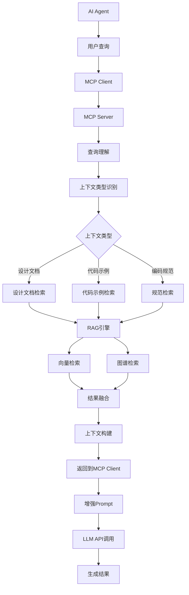
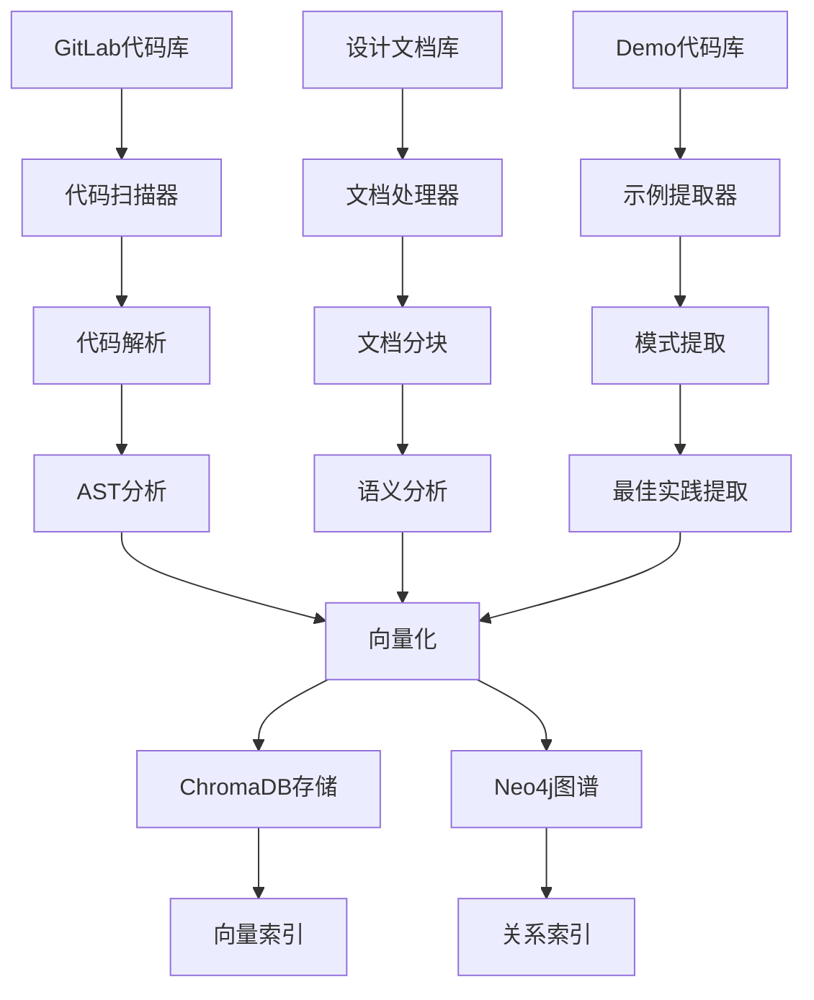
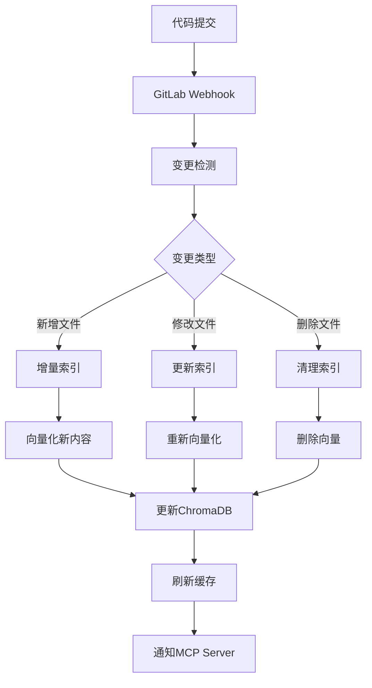

# AI Agent上下文增强系统方案 (基于Graph RAG)

## 1. 项目概述

### 1.1 背景问题
- 现有AI Agent缺乏团队业务上下文信息
- 生成的代码不符合团队规范和业务场景
- 无法自动使用团队内部工具和框架
- 缺乏项目设计文档和Demo代码的上下文支持

### 1.2 解决目标
- 基于MCP（Model Context Protocol）为AI Agent提供动态上下文
- 通过Graph RAG技术构建团队知识图谱
- 提供便捷的文档和代码管理前端
- 利用LLM参与智能chunking和知识提取
- 部署到K8s环境，提供企业级服务能力

### 1.3 核心特色
- **智能文档管理**: 支持业务文档和Demo代码的分类管理
- **Graph RAG增强**: 构建实体关系图谱，提供更精准的上下文检索
- **LLM辅助处理**: 利用LLM进行智能文档分块和知识提取
- **团队分类管理**: 按团队-项目-模块-类型的层次化管理

## 2. 系统架构设计

### 2.1 整体架构（基于Graph RAG）

```
┌─────────────────────────────────────────────────────────────┐
│                    AI Agent 层                             │
├─────────────────────┬───────────────────────────────────────┤
│   现有AI Agent     │        LLM API调用                    │
│   (保持不变)        │        (Qwen3-32B)                   │
└─────────────────────┴───────────────────────────────────────┘
                              ↑ MCP协议
┌─────────────────────────────────────────────────────────────┐
│                    MCP Server 层                           │
├─────────────────────┬───────────────────────────────────────┤
│   Context Provider  │        Tool Provider                 │
│   (上下文提供器)     │        (工具提供器)                   │
└─────────────────────┴───────────────────────────────────────┘
                              ↑ Graph RAG检索
┌─────────────────────────────────────────────────────────────┐
│                    Graph RAG 引擎层                        │
├─────────────────────┬───────────────────────────────────────┤
│   实体提取引擎      │        图谱查询引擎                    │
│   (Entity Extract)  │        (Graph Query)                 │
└─────────────────────┴───────────────────────────────────────┘
                              ↑ 知识图谱
┌─────────────────────────────────────────────────────────────┐
│                    知识存储层                               │
├─────────────┬─────────────┬─────────────┬─────────────────┤
│  知识图谱   │   向量库    │   文档库    │    元数据库      │
│  (Neo4j)   │(ChromaDB)   │(MinIO)     │   (PostgreSQL)  │
└─────────────┴─────────────┴─────────────┴─────────────────┘
                              ↑ 数据管理
┌─────────────────────────────────────────────────────────────┐
│                    前端管理界面                              │
├─────────────────────┬───────────────────────────────────────┤
│   文档管理模块      │        代码管理模块                    │
│   (Doc Management)  │        (Code Management)             │
└─────────────────────┴───────────────────────────────────────┘
```

### 2.2 Graph RAG核心原理

Graph RAG是Microsoft Research提出的增强RAG技术，核心思想是：

1. **实体识别**: 从文档中提取关键实体（函数、类、概念等）
2. **关系构建**: 建立实体间的语义关系图谱
3. **社区发现**: 通过图算法发现相关实体的聚类
4. **多层检索**: 结合向量检索和图谱遍历获取上下文

#### 2.2.1 Graph RAG vs 传统RAG对比

| 特性 | 传统RAG | Graph RAG |
|------|---------|-----------|
| **检索方式** | 基于相似度的向量检索 | 向量检索 + 图谱遍历 |
| **上下文理解** | 局部语义相似 | 全局关系理解 |
| **多跳推理** | 不支持 | 支持多跳关系查询 |
| **实体关系** | 隐式 | 显式建模 |
| **可解释性** | 较弱 | 较强（可追溯推理路径） |

### 2.3 分层知识管理

#### 2.3.1 知识分类体系
```
团队知识库
├── 业务文档类
│   ├── 概要设计文档
│   ├── 详细设计文档  
│   ├── API接口文档
│   ├── 数据库设计文档
│   └── 架构设计文档
└── Demo代码类
    ├── API模块代码
    ├── 业务逻辑代码
    ├── 数据库操作代码
    ├── 单元测试代码
    └── 工具类代码
```

#### 2.3.2 元数据结构
```json
{
  "document_id": "doc_001",
  "type": "business_doc",  // 或 "demo_code"
  "team": "backend_team",
  "project": "user_service",
  "module": "authentication",
  "dev_type": "api_design",  // API设计/业务逻辑/数据库/测试等
  "title": "用户认证模块API设计",
  "description": "包含用户登录、注册、Token刷新等API的设计文档",
  "upload_time": "2024-01-15T10:30:00Z",
  "file_path": "/docs/backend_team/user_service/auth/api_design.md",
  "status": "active",
  "version": "1.2",
  "related_files": ["auth_api.py", "test_auth.py"],
  "tags": ["authentication", "jwt", "api"],
  "graph_entities": ["User", "Token", "LoginAPI", "RegisterAPI"],
  "chunk_count": 12,
  "embedding_status": "completed"
}
```

## 3. 技术栈选择

### 3.1 Graph RAG技术栈

#### 3.1.1 图谱构建
- **Neo4j Community**: 开源图数据库
  - 原生图存储引擎
  - Cypher查询语言
  - 图算法库(GDS)
  - 社区发现算法

#### 3.1.2 实体识别和关系提取
- **Qwen3-32B**: 用于实体识别和关系提取
  - 通过Few-shot学习识别代码和文档中的实体
  - 提取实体间的语义关系
- **spaCy**: 辅助NLP处理
  - 命名实体识别
  - 依存句法分析

#### 3.1.3 向量化组件
- **Qwen3-Embedding-8B**: 使用您API中的embedding模型
  - 支持长文本embedding
  - 中英文混合效果好
  - API调用方式部署

### 3.2 前端管理系统

#### 3.2.1 文档管理界面
- **React 18**: 用户界面框架
- **Ant Design Pro**: 企业级管理后台
- **Monaco Editor**: 代码编辑器
- **React-Flow**: 知识图谱可视化

#### 3.2.2 文件存储和管理
- **MinIO**: 对象存储服务
  - S3兼容API
  - 文件版本管理
  - 访问权限控制

### 3.3 智能处理服务

#### 3.3.1 LLM辅助chunking
- **Qwen3-32B**: 智能文档分块
  - 理解文档语义结构
  - 保持逻辑完整性的分块
  - 生成chunk摘要和标题

#### 3.3.2 后端服务框架
- **FastAPI**: 高性能Web框架
- **Celery**: 异步任务处理
- **PostgreSQL**: 元数据和用户管理
  - 用户认证和权限管理
  - 文档元数据存储（JSON字段支持复杂结构）
  - 全文搜索功能（支持中文分词）
  - 审计日志和操作记录
  - 支持事务确保数据一致性
  - 与Neo4j集成，可作为图数据库的数据源
  - pgvector扩展支持向量搜索辅助功能
- **Redis**: 缓存和消息队列

### 3.4 PostgreSQL vs MySQL选择说明

**为什么选择PostgreSQL而不是MySQL：**

1. **JSON/JSONB支持**: PostgreSQL原生支持JSON和JSONB数据类型，对于存储文档元数据、用户配置、标签等非结构化数据更加灵活高效

2. **全文搜索能力**: PostgreSQL内置强大的全文搜索功能，支持中文分词，可以直接在数据库层面实现文档内容搜索，无需额外的搜索引擎

3. **扩展性和自定义类型**: 支持自定义数据类型、函数和扩展，可以安装pgvector扩展支持向量相似度计算，与我们的Graph RAG系统集成更好

4. **更完整的ACID特性**: 对于知识图谱这种涉及复杂关系的数据，PostgreSQL的事务处理和并发控制更加可靠

5. **与图数据库集成**: PostgreSQL可以很好地与Neo4j集成，作为图数据库的关系数据源，支持复杂查询和数据同步

6. **企业级特性**: 更好的并发控制、行级锁定、复杂查询优化，适合企业级应用的性能要求

## 4. 核心功能模块

### 4.1 前端文档管理系统

#### 4.1.0 依赖注入框架设计

**IoC容器实现**
```typescript
// core/DIContainer.ts
export class DIContainer {
  private static instance: DIContainer;
  private services: Map<string, any> = new Map();
  private factories: Map<string, () => any> = new Map();
  private singletons: Map<string, any> = new Map();

  static getInstance(): DIContainer {
    if (!DIContainer.instance) {
      DIContainer.instance = new DIContainer();
    }
    return DIContainer.instance;
  }

  // 注册单例服务
  registerSingleton<T>(token: string, factory: () => T): void {
    this.factories.set(token, factory);
  }

  // 注册瞬态服务
  registerTransient<T>(token: string, factory: () => T): void {
    this.services.set(token, factory);
  }

  // 解析服务
  resolve<T>(token: string): T {
    // 先检查单例缓存
    if (this.singletons.has(token)) {
      return this.singletons.get(token);
    }

    // 检查单例工厂
    if (this.factories.has(token)) {
      const instance = this.factories.get(token)();
      this.singletons.set(token, instance);
      return instance;
    }

    // 检查瞬态服务
    if (this.services.has(token)) {
      return this.services.get(token)();
    }

    throw new Error(`Service ${token} not registered`);
  }
}

// 服务配置
export const configureServices = () => {
  const container = DIContainer.getInstance();

  // HTTP客户端配置
  container.registerSingleton('ApiClient', () => 
    new ApiClient({
      baseURL: process.env.REACT_APP_API_BASE_URL || '/api',
      timeout: 10000,
      withCredentials: true
    })
  );

  // Token存储配置
  container.registerSingleton('TokenStorage', () => 
    new TokenStorage(localStorage)
  );

  // 认证服务配置
  container.registerSingleton('IAuthService', () => 
    new AuthService(
      container.resolve('ApiClient'),
      container.resolve('TokenStorage')
    )
  );

  // 文档服务配置
  container.registerSingleton('IDocumentService', () => 
    new DocumentService(
      container.resolve('ApiClient'),
      container.resolve('IAuthService')
    )
  );

  // 分类服务配置
  container.registerSingleton('IClassificationService', () => 
    new ClassificationService(
      container.resolve('ApiClient')
    )
  );

  // 通知服务配置
  container.registerSingleton('INotificationService', () => 
    new NotificationService()
  );
};

// React Hook for DI
export const useService = <T>(token: string): T => {
  return useMemo(() => {
    return DIContainer.getInstance().resolve<T>(token);
  }, [token]);
};
```

**服务抽象层**
```typescript
// services/base/BaseService.ts
export abstract class BaseService {
  protected apiClient: ApiClient;
  protected authService: IAuthService;

  constructor(apiClient: ApiClient, authService: IAuthService) {
    this.apiClient = apiClient;
    this.authService = authService;
  }

  protected async makeAuthenticatedRequest<T>(
    method: 'GET' | 'POST' | 'PUT' | 'DELETE',
    url: string,
    data?: any,
    config?: AxiosRequestConfig
  ): Promise<T> {
    try {
      const token = await this.authService.getAccessToken();
      const response = await this.apiClient.request({
        method,
        url,
        data,
        headers: {
          ...config?.headers,
          Authorization: `Bearer ${token}`
        },
        ...config
      });
      return response.data;
    } catch (error) {
      if (error.response?.status === 401) {
        await this.authService.refreshToken();
        return this.makeAuthenticatedRequest(method, url, data, config);
      }
      throw error;
    }
  }
}

// 错误处理服务
export interface IErrorHandler {
  handleError(error: Error, context?: string): void;
  showUserError(message: string, type?: 'error' | 'warning' | 'info'): void;
}

export class ErrorHandlerService implements IErrorHandler {
  private notificationService: INotificationService;

  constructor(notificationService: INotificationService) {
    this.notificationService = notificationService;
  }

  handleError(error: Error, context?: string): void {
    console.error(`[${context || 'Unknown'}] Error:`, error);
    
    // 根据错误类型进行不同处理
    if (error.name === 'NetworkError') {
      this.showUserError('网络连接失败，请检查网络设置');
    } else if (error.name === 'AuthenticationError') {
      this.showUserError('认证失败，请重新登录');
    } else if (error.name === 'PermissionError') {
      this.showUserError('权限不足，无法执行此操作');
    } else {
      this.showUserError('操作失败，请稍后重试');
    }

    // 发送错误日志到服务器
    this.sendErrorLog(error, context);
  }

  showUserError(message: string, type: 'error' | 'warning' | 'info' = 'error'): void {
    this.notificationService.show(message, type);
  }

  private async sendErrorLog(error: Error, context?: string): Promise<void> {
    try {
      await fetch('/api/logs/errors', {
        method: 'POST',
        headers: { 'Content-Type': 'application/json' },
        body: JSON.stringify({
          message: error.message,
          stack: error.stack,
          context,
          timestamp: new Date().toISOString(),
          userAgent: navigator.userAgent,
          url: window.location.href
        })
      });
    } catch (logError) {
      console.error('Failed to send error log:', logError);
    }
  }
}
```

#### 4.1.1 系统架构设计（面向接口编程）
#### 4.1.2 接口定义层
```typescript
// interfaces/IAuthService.ts
export interface IUser {
  id: string;
  username: string;
  email: string;
  teams: string[];
  role: 'admin' | 'manager' | 'developer';
  avatar?: string;
  created_at: string;
}

export interface IAuthService {
  login(credentials: LoginCredentials): Promise<AuthResult>;
  logout(): Promise<void>;
  getCurrentUser(): Promise<IUser | null>;
  refreshToken(): Promise<string>;
  hasPermission(resource: string, action: string): boolean;
}

// interfaces/IDocumentService.ts
export interface IDocumentMetadata {
  id: string;
  type: 'business_doc' | 'demo_code';
  team: string;
  project: string;
  module: string;
  dev_type: string;
  title: string;
  description: string;
  file_name: string;
  file_size: number;
  upload_time: string;
  uploaded_by: string;  // 用户ID
  uploader_name: string; // 用户显示名
  status: 'processing' | 'completed' | 'failed';
  chunk_count?: number;
  entity_count?: number;
  tags: string[];
  version: string;
  access_level: 'private' | 'team' | 'public';
}

export interface IDocumentService {
  uploadDocument(file: File, metadata: Partial<IDocumentMetadata>): Promise<string>;
  getDocuments(filters?: DocumentFilters): Promise<IDocumentMetadata[]>;
  deleteDocument(id: string): Promise<void>;
  updateDocument(id: string, updates: Partial<IDocumentMetadata>): Promise<void>;
  getDocumentContent(id: string): Promise<string>;
  searchDocuments(query: string, filters?: DocumentFilters): Promise<IDocumentMetadata[]>;
}

// interfaces/IClassificationService.ts
export interface IClassificationHierarchy {
  teams: TeamInfo[];
  projects: ProjectInfo[];
  modules: ModuleInfo[];
  devTypes: DevTypeInfo[];
}

export interface IClassificationService {
  getTeamsByUser(userId: string): Promise<TeamInfo[]>;
  getProjectsByTeam(teamId: string): Promise<ProjectInfo[]>;
  getModulesByProject(projectId: string): Promise<ModuleInfo[]>;
  getDevTypesByCategory(category: 'business_doc' | 'demo_code'): Promise<DevTypeInfo[]>;
  validateClassification(classification: DocumentClassification): Promise<boolean>;
}
```

**服务实现层**
```typescript
// services/AuthService.ts
import { IAuthService, IUser } from '../interfaces/IAuthService';

export class AuthService implements IAuthService {
  private apiClient: ApiClient;
  private tokenStorage: TokenStorage;

  constructor(apiClient: ApiClient, tokenStorage: TokenStorage) {
    this.apiClient = apiClient;
    this.tokenStorage = tokenStorage;
  }

  async login(credentials: LoginCredentials): Promise<AuthResult> {
    try {
      const response = await this.apiClient.post('/auth/login', credentials);
      
      if (response.success) {
        await this.tokenStorage.setTokens({
          accessToken: response.data.access_token,
          refreshToken: response.data.refresh_token
        });
        
        return {
          success: true,
          user: response.data.user,
          permissions: response.data.permissions
        };
      }
      
      return { success: false, error: response.message };
    } catch (error) {
      return { success: false, error: '登录失败，请检查网络连接' };
    }
  }

  async getCurrentUser(): Promise<IUser | null> {
    const token = await this.tokenStorage.getAccessToken();
    if (!token) return null;

    try {
      const response = await this.apiClient.get('/auth/user');
      return response.data;
    } catch (error) {
      if (error.status === 401) {
        await this.refreshToken();
        return this.getCurrentUser();
      }
      return null;
    }
  }

  hasPermission(resource: string, action: string): boolean {
    // 基于角色的权限检查逻辑
    const user = this.getCurrentUserSync();
    if (!user) return false;

    const permissions = this.getPermissionsByRole(user.role);
    return permissions.some(p => p.resource === resource && p.actions.includes(action));
  }
}

// services/DocumentService.ts
export class DocumentService implements IDocumentService {
  private apiClient: ApiClient;
  private authService: IAuthService;

  constructor(apiClient: ApiClient, authService: IAuthService) {
    this.apiClient = apiClient;
    this.authService = authService;
  }

  async uploadDocument(file: File, metadata: Partial<IDocumentMetadata>): Promise<string> {
    // 检查权限
    if (!this.authService.hasPermission('documents', 'create')) {
      throw new Error('没有上传权限');
    }

    const currentUser = await this.authService.getCurrentUser();
    if (!currentUser) {
      throw new Error('用户未登录');
    }

    const formData = new FormData();
    formData.append('file', file);
    formData.append('metadata', JSON.stringify({
      ...metadata,
      uploaded_by: currentUser.id,
      uploader_name: currentUser.username,
      upload_time: new Date().toISOString()
    }));

    const response = await this.apiClient.post('/documents/upload', formData, {
      headers: { 'Content-Type': 'multipart/form-data' }
    });

    return response.data.document_id;
  }

  async getDocuments(filters?: DocumentFilters): Promise<IDocumentMetadata[]> {
    const currentUser = await this.authService.getCurrentUser();
    if (!currentUser) return [];

    // 基于用户权限过滤
    const userFilters = {
      ...filters,
      accessible_by: currentUser.id,
      teams: currentUser.teams
    };

    const response = await this.apiClient.get('/documents', { params: userFilters });
    return response.data;
  }
}
```

#### 4.1.2 登录认证组件
```tsx
// components/auth/LoginForm.tsx
import React, { useState } from 'react';
import { Form, Input, Button, Card, Alert, Spin } from 'antd';
import { UserOutlined, LockOutlined } from '@ant-design/icons';
import { useAuth } from '../../hooks/useAuth';

interface LoginFormProps {
  onSuccess?: () => void;
}

export const LoginForm: React.FC<LoginFormProps> = ({ onSuccess }) => {
  const [loading, setLoading] = useState(false);
  const [error, setError] = useState<string | null>(null);
  const { login } = useAuth();

  const handleSubmit = async (values: { username: string; password: string }) => {
    setLoading(true);
    setError(null);

    try {
      const result = await login({
        username: values.username,
        password: values.password
      });

      if (result.success) {
        onSuccess?.();
      } else {
        setError(result.error || '登录失败');
      }
    } catch (err) {
      setError('网络错误，请重试');
    } finally {
      setLoading(false);
    }
  };

  return (
    <div className="login-container" style={{ 
      display: 'flex', 
      justifyContent: 'center', 
      alignItems: 'center', 
      minHeight: '100vh',
      background: 'linear-gradient(135deg, #667eea 0%, #764ba2 100%)'
    }}>
      <Card 
        title="AI上下文增强系统" 
        style={{ width: 400, boxShadow: '0 4px 12px rgba(0,0,0,0.15)' }}
      >
        {error && (
          <Alert 
            message={error} 
            type="error" 
            showIcon 
            style={{ marginBottom: 16 }} 
          />
        )}
        
        <Form
          name="login"
          onFinish={handleSubmit}
          autoComplete="off"
          size="large"
        >
          <Form.Item
            name="username"
            rules={[{ required: true, message: '请输入用户名' }]}
          >
            <Input 
              prefix={<UserOutlined />} 
              placeholder="用户名" 
            />
          </Form.Item>

          <Form.Item
            name="password"
            rules={[{ required: true, message: '请输入密码' }]}
          >
            <Input.Password 
              prefix={<LockOutlined />} 
              placeholder="密码" 
            />
          </Form.Item>

          <Form.Item>
            <Button 
              type="primary" 
              htmlType="submit" 
              loading={loading}
              style={{ width: '100%' }}
            >
              {loading ? <Spin size="small" /> : '登录'}
            </Button>
          </Form.Item>
        </Form>
      </Card>
    </div>
  );
};

// hooks/useAuth.tsx
import { createContext, useContext, useEffect, useState } from 'react';
import { IUser, IAuthService } from '../interfaces/IAuthService';
import { AuthService } from '../services/AuthService';

interface AuthContextType {
  user: IUser | null;
  loading: boolean;
  login: (credentials: LoginCredentials) => Promise<AuthResult>;
  logout: () => Promise<void>;
  hasPermission: (resource: string, action: string) => boolean;
}

const AuthContext = createContext<AuthContextType | null>(null);

export const AuthProvider: React.FC<{ children: React.ReactNode }> = ({ children }) => {
  const [user, setUser] = useState<IUser | null>(null);
  const [loading, setLoading] = useState(true);
  const authService = new AuthService(/* 依赖注入 */);

  useEffect(() => {
    checkAuthState();
  }, []);

  const checkAuthState = async () => {
    try {
      const currentUser = await authService.getCurrentUser();
      setUser(currentUser);
    } catch (error) {
      console.error('Auth check failed:', error);
    } finally {
      setLoading(false);
    }
  };

  const login = async (credentials: LoginCredentials): Promise<AuthResult> => {
    const result = await authService.login(credentials);
    if (result.success) {
      setUser(result.user);
    }
    return result;
  };

  const logout = async () => {
    await authService.logout();
    setUser(null);
  };

  const hasPermission = (resource: string, action: string): boolean => {
    return authService.hasPermission(resource, action);
  };

  return (
    <AuthContext.Provider value={{
      user,
      loading,
      login,
      logout,
      hasPermission
    }}>
      {children}
    </AuthContext.Provider>
  );
};

export const useAuth = () => {
  const context = useContext(AuthContext);
  if (!context) {
    throw new Error('useAuth must be used within AuthProvider');
  }
  return context;
};
```

#### 4.1.3 智能分类选择组件
```tsx
// components/classification/ClassificationSelector.tsx
import React, { useState, useEffect, useCallback } from 'react';
import { Select, Cascader, Form, Space, Tag } from 'antd';
import { useAuth } from '../../hooks/useAuth';
import { IClassificationService } from '../../interfaces/IClassificationService';

interface ClassificationSelectorProps {
  value?: DocumentClassification;
  onChange?: (classification: DocumentClassification) => void;
  documentType: 'business_doc' | 'demo_code';
}

export const ClassificationSelector: React.FC<ClassificationSelectorProps> = ({
  value,
  onChange,
  documentType
}) => {
  const { user } = useAuth();
  const [teamOptions, setTeamOptions] = useState<TeamOption[]>([]);
  const [projectOptions, setProjectOptions] = useState<ProjectOption[]>([]);
  const [moduleOptions, setModuleOptions] = useState<ModuleOption[]>([]);
  const [devTypeOptions, setDevTypeOptions] = useState<DevTypeOption[]>([]);
  const [loading, setLoading] = useState(false);

  const classificationService = new ClassificationService(); // 依赖注入

  // 加载用户可访问的团队
  useEffect(() => {
    if (user) {
      loadUserTeams();
    }
  }, [user]);

  // 根据文档类型加载开发类型选项
  useEffect(() => {
    loadDevTypes();
  }, [documentType]);

  const loadUserTeams = async () => {
    try {
      const teams = await classificationService.getTeamsByUser(user!.id);
      setTeamOptions(teams.map(team => ({
        label: team.display_name,
        value: team.id,
        description: team.description
      })));
    } catch (error) {
      console.error('加载团队失败:', error);
    }
  };

  const loadProjectsByTeam = useCallback(async (teamId: string) => {
    if (!teamId) {
      setProjectOptions([]);
      setModuleOptions([]);
      return;
    }

    setLoading(true);
    try {
      const projects = await classificationService.getProjectsByTeam(teamId);
      setProjectOptions(projects.map(project => ({
        label: project.display_name,
        value: project.id,
        description: project.description,
        tech_stack: project.tech_stack
      })));
    } catch (error) {
      console.error('加载项目失败:', error);
    } finally {
      setLoading(false);
    }
  }, []);

  const loadModulesByProject = useCallback(async (projectId: string) => {
    if (!projectId) {
      setModuleOptions([]);
      return;
    }

    try {
      const modules = await classificationService.getModulesByProject(projectId);
      setModuleOptions(modules.map(module => ({
        label: module.display_name,
        value: module.id,
        description: module.description,
        module_type: module.module_type
      })));
    } catch (error) {
      console.error('加载模块失败:', error);
    }
  }, []);

  const loadDevTypes = async () => {
    try {
      const devTypes = await classificationService.getDevTypesByCategory(documentType);
      setDevTypeOptions(devTypes.map(type => ({
        label: type.display_name,
        value: type.id,
        description: type.description,
        icon: type.icon
      })));
    } catch (error) {
      console.error('加载开发类型失败:', error);
    }
  };

  const handleTeamChange = (teamId: string) => {
    const newClassification = {
      ...value,
      team: teamId,
      project: '',
      module: ''
    };
    onChange?.(newClassification);
    loadProjectsByTeam(teamId);
  };

  const handleProjectChange = (projectId: string) => {
    const newClassification = {
      ...value,
      project: projectId,
      module: ''
    };
    onChange?.(newClassification);
    loadModulesByProject(projectId);
  };

  const handleModuleChange = (moduleId: string) => {
    const newClassification = {
      ...value,
      module: moduleId
    };
    onChange?.(newClassification);
  };

  const handleDevTypeChange = (devTypeId: string) => {
    const newClassification = {
      ...value,
      dev_type: devTypeId
    };
    onChange?.(newClassification);
  };

  return (
    <Space direction="vertical" style={{ width: '100%' }}>
      <Form.Item
        label="所属团队"
        required
        help="选择文档所属的开发团队"
      >
        <Select
          placeholder="请选择团队"
          value={value?.team}
          onChange={handleTeamChange}
          loading={loading}
          showSearch
          optionFilterProp="children"
        >
          {teamOptions.map(option => (
            <Select.Option key={option.value} value={option.value}>
              <div>
                <div>{option.label}</div>
                <div style={{ fontSize: '12px', color: '#666' }}>
                  {option.description}
                </div>
              </div>
            </Select.Option>
          ))}
        </Select>
      </Form.Item>

      <Form.Item
        label="所属项目"
        required
        help="选择文档关联的具体项目"
      >
        <Select
          placeholder="请先选择团队"
          value={value?.project}
          onChange={handleProjectChange}
          disabled={!value?.team}
          loading={loading}
          showSearch
          optionFilterProp="children"
        >
          {projectOptions.map(option => (
            <Select.Option key={option.value} value={option.value}>
              <div>
                <div style={{ display: 'flex', alignItems: 'center', gap: 8 }}>
                  <span>{option.label}</span>
                  {option.tech_stack && (
                    <Tag size="small" color="blue">{option.tech_stack}</Tag>
                  )}
                </div>
                <div style={{ fontSize: '12px', color: '#666' }}>
                  {option.description}
                </div>
              </div>
            </Select.Option>
          ))}
        </Select>
      </Form.Item>

      <Form.Item
        label="所属模块"
        required
        help="选择文档所在的功能模块"
      >
        <Select
          placeholder="请先选择项目"
          value={value?.module}
          onChange={handleModuleChange}
          disabled={!value?.project}
          showSearch
          optionFilterProp="children"
        >
          {moduleOptions.map(option => (
            <Select.Option key={option.value} value={option.value}>
              <div>
                <div style={{ display: 'flex', alignItems: 'center', gap: 8 }}>
                  <span>{option.label}</span>
                  <Tag size="small" color="green">{option.module_type}</Tag>
                </div>
                <div style={{ fontSize: '12px', color: '#666' }}>
                  {option.description}
                </div>
              </div>
            </Select.Option>
          ))}
        </Select>
      </Form.Item>

      <Form.Item
        label="开发类型"
        required
        help={`选择${documentType === 'business_doc' ? '业务文档' : 'Demo代码'}的具体类型`}
      >
        <Select
          placeholder="请选择开发类型"
          value={value?.dev_type}
          onChange={handleDevTypeChange}
          showSearch
          optionFilterProp="children"
        >
          {devTypeOptions.map(option => (
            <Select.Option key={option.value} value={option.value}>
              <div style={{ display: 'flex', alignItems: 'center', gap: 8 }}>
                {option.icon && <span>{option.icon}</span>}
                <div>
                  <div>{option.label}</div>
                  <div style={{ fontSize: '12px', color: '#666' }}>
                    {option.description}
                  </div>
                </div>
              </div>
            </Select.Option>
          ))}
        </Select>
      </Form.Item>
    </Space>
  );
};
```

#### 4.1.4 增强的文档管理界面
```tsx
// components/DocumentManager.tsx
import React, { useState, useEffect } from 'react';
import { 
  Table, Upload, Button, Modal, Form, Select, 
  Input, Tag, Space, Popconfirm, message, Avatar,
  Tooltip, Badge, Dropdown, Menu
} from 'antd';
import { 
  UploadOutlined, DeleteOutlined, EyeOutlined, 
  UserOutlined, TeamOutlined, FilterOutlined,
  DownloadOutlined, EditOutlined
} from '@ant-design/icons';
import { useAuth } from '../hooks/useAuth';
import { ClassificationSelector } from './classification/ClassificationSelector';
import { DocumentViewer } from './DocumentViewer';

const { Option } = Select;
const { TextArea } = Input;

interface DocumentItem {
  id: string;
  type: 'business_doc' | 'demo_code';
  team: string;
  project: string;
  module: string;
  dev_type: string;
  title: string;
  description: string;
  file_name: string;
  file_size: number;
  upload_time: string;
  uploaded_by: string;
  uploader_name: string;
  uploader_avatar?: string;
  status: 'processing' | 'completed' | 'failed';
  chunk_count?: number;
  entity_count?: number;
  tags: string[];
  access_level: 'private' | 'team' | 'public';
  version: string;
  download_count: number;
  last_modified: string;
}

export const DocumentManager: React.FC = () => {
  const { user, hasPermission } = useAuth();
  const [documents, setDocuments] = useState<DocumentItem[]>([]);
  const [uploadModalVisible, setUploadModalVisible] = useState(false);
  const [filters, setFilters] = useState<DocumentFilters>({});
  const [form] = Form.useForm();
  const [loading, setLoading] = useState(false);
  const [selectedRows, setSelectedRows] = useState<string[]>([]);

  const documentService = new DocumentService(); // 依赖注入

  // 表格列定义
  const columns = [
    {
      title: '文档信息',
      key: 'document_info',
      width: 300,
      render: (_, record: DocumentItem) => (
        <div>
          <div style={{ display: 'flex', alignItems: 'center', gap: 8, marginBottom: 4 }}>
            <strong>{record.title}</strong>
            <Tag color={record.type === 'business_doc' ? 'blue' : 'green'} size="small">
              {record.type === 'business_doc' ? '业务文档' : 'Demo代码'}
            </Tag>
            <Badge 
              count={record.access_level === 'private' ? '私有' : record.access_level === 'team' ? '团队' : '公开'} 
              color={record.access_level === 'private' ? 'red' : record.access_level === 'team' ? 'orange' : 'green'}
              size="small"
            />
          </div>
          <div style={{ fontSize: '12px', color: '#666', marginBottom: 4 }}>
            {record.description}
          </div>
          <div style={{ fontSize: '11px', color: '#999' }}>
            文件: {record.file_name} ({(record.file_size / 1024).toFixed(1)}KB)
          </div>
        </div>
      ),
    },
    {
      title: '分类路径',
      key: 'classification',
      width: 250,
      render: (_, record: DocumentItem) => (
        <div>
          <div style={{ display: 'flex', alignItems: 'center', gap: 4, marginBottom: 2 }}>
            <TeamOutlined style={{ color: '#1890ff' }} />
            <span style={{ fontSize: '12px' }}>{record.team}</span>
          </div>
          <div style={{ fontSize: '11px', color: '#666', lineHeight: 1.4 }}>
            项目: {record.project}<br/>
            模块: {record.module}<br/>
            类型: {record.dev_type}
          </div>
        </div>
      ),
    },
    {
      title: '上传者',
      key: 'uploader',
      width: 120,
      render: (_, record: DocumentItem) => (
        <div style={{ display: 'flex', alignItems: 'center', gap: 8 }}>
          <Avatar 
            size="small" 
            src={record.uploader_avatar} 
            icon={!record.uploader_avatar && <UserOutlined />}
          />
          <div>
            <div style={{ fontSize: '12px' }}>{record.uploader_name}</div>
            <div style={{ fontSize: '11px', color: '#999' }}>
              {new Date(record.upload_time).toLocaleDateString()}
            </div>
          </div>
        </div>
      ),
    },
    {
      title: '处理状态',
      key: 'status',
      width: 120,
      render: (_, record: DocumentItem) => {
        const statusMap = {
          processing: { color: 'orange', text: '处理中', icon: '⏳' },
          completed: { color: 'green', text: '已完成', icon: '✅' },
          failed: { color: 'red', text: '处理失败', icon: '❌' }
        };
        const config = statusMap[record.status as keyof typeof statusMap];
        
        return (
          <div>
            <Tag color={config.color} style={{ marginBottom: 4 }}>
              {config.icon} {config.text}
            </Tag>
            {record.status === 'completed' && (
              <div style={{ fontSize: '11px', color: '#666' }}>
                <div>📄 文本块: {record.chunk_count}</div>
                <div>🔗 实体数: {record.entity_count}</div>
                <div>📥 下载: {record.download_count}次</div>
              </div>
            )}
          </div>
        );
      },
    },
    {
      title: '操作',
      key: 'actions',
      width: 200,
      render: (_, record: DocumentItem) => {
        const actionMenu = (
          <Menu>
            <Menu.Item 
              key="view" 
              icon={<EyeOutlined />}
              onClick={() => viewDocument(record)}
            >
              查看详情
            </Menu.Item>
            <Menu.Item 
              key="download" 
              icon={<DownloadOutlined />}
              onClick={() => downloadDocument(record)}
            >
              下载文件
            </Menu.Item>
            {hasPermission('documents', 'update') && record.uploaded_by === user?.id && (
              <Menu.Item 
                key="edit" 
                icon={<EditOutlined />}
                onClick={() => editDocument(record)}
              >
                编辑信息
              </Menu.Item>
            )}
            {hasPermission('documents', 'delete') && (
              <Menu.Divider />
            )}
            {hasPermission('documents', 'delete') && (
              <Menu.Item 
                key="delete" 
                icon={<DeleteOutlined />}
                danger
                onClick={() => showDeleteConfirm(record)}
              >
                删除文档
              </Menu.Item>
            )}
          </Menu>
        );

        return (
          <Space>
            <Button 
              type="primary" 
              ghost 
              size="small" 
              icon={<EyeOutlined />}
              onClick={() => viewDocument(record)}
            >
              查看
            </Button>
            <Dropdown overlay={actionMenu} trigger={['click']}>
              <Button size="small">
                更多 ▼
              </Button>
            </Dropdown>
          </Space>
        );
      },
    },
  ];

  // 业务逻辑方法
  const handleUpload = async (values: any, file: File) => {
    if (!hasPermission('documents', 'create')) {
      message.error('您没有上传文档的权限');
      return;
    }

    setLoading(true);
    try {
      const documentId = await documentService.uploadDocument(file, {
        ...values,
        uploaded_by: user!.id,
        uploader_name: user!.username
      });

      message.success('文档上传成功，正在处理中...');
      setUploadModalVisible(false);
      form.resetFields();
      await loadDocuments();
    } catch (error) {
      message.error('上传失败: ' + (error as Error).message);
    } finally {
      setLoading(false);
    }
  };

  const deleteDocument = async (id: string) => {
    if (!hasPermission('documents', 'delete')) {
      message.error('您没有删除权限');
      return;
    }

    try {
      await documentService.deleteDocument(id);
      message.success('文档删除成功');
      await loadDocuments();
    } catch (error) {
      message.error('删除失败: ' + (error as Error).message);
    }
  };

  const showDeleteConfirm = (document: DocumentItem) => {
    Modal.confirm({
      title: '确定要删除这个文档吗？',
      content: (
        <div>
          <p>文档: <strong>{document.title}</strong></p>
          <p style={{ color: '#ff4d4f' }}>
            ⚠️ 删除后相关的向量数据和图谱数据也会被清除，此操作不可恢复
          </p>
        </div>
      ),
      okText: '确定删除',
      okType: 'danger',
      cancelText: '取消',
      onOk: () => deleteDocument(document.id),
    });
  };

  const viewDocument = (document: DocumentItem) => {
    Modal.info({
      title: `文档详情 - ${document.title}`,
      width: 1000,
      content: <DocumentViewer document={document} />,
      footer: null,
    });
  };

  const downloadDocument = async (document: DocumentItem) => {
    try {
      const response = await fetch(`/api/documents/${document.id}/download`);
      const blob = await response.blob();
      const url = window.URL.createObjectURL(blob);
      const a = document.createElement('a');
      a.style.display = 'none';
      a.href = url;
      a.download = document.file_name;
      document.body.appendChild(a);
      a.click();
      window.URL.revokeObjectURL(url);
      message.success('下载开始');
    } catch (error) {
      message.error('下载失败');
    }
  };

  const editDocument = (document: DocumentItem) => {
    // 编辑文档信息的逻辑
    Modal.info({
      title: '编辑文档信息',
      content: '编辑功能开发中...',
    });
  };

  const loadDocuments = async () => {
    try {
      setLoading(true);
      const docs = await documentService.getDocuments(filters);
      setDocuments(docs);
    } catch (error) {
      message.error('加载文档列表失败');
    } finally {
      setLoading(false);
    }
  };

  const handleBatchDelete = async () => {
    if (selectedRows.length === 0) {
      message.warning('请先选择要删除的文档');
      return;
    }

    Modal.confirm({
      title: `确定要删除选中的 ${selectedRows.length} 个文档吗？`,
      content: '批量删除操作不可恢复',
      okText: '确定删除',
      okType: 'danger',
      cancelText: '取消',
      onOk: async () => {
        try {
          await Promise.all(
            selectedRows.map(id => documentService.deleteDocument(id))
          );
          message.success(`成功删除 ${selectedRows.length} 个文档`);
          setSelectedRows([]);
          await loadDocuments();
        } catch (error) {
          message.error('批量删除失败');
        }
      },
    });
  };

  // 组件加载时获取数据
  useEffect(() => {
    if (user) {
      loadDocuments();
    }
  }, [user, filters]);

  // 筛选和搜索
  const handleFilterChange = (newFilters: Partial<DocumentFilters>) => {
    setFilters(prev => ({ ...prev, ...newFilters }));
  };

  return (
    <div className="document-manager">
      {/* 工具栏 */}
      <div style={{ 
        marginBottom: 16, 
        display: 'flex', 
        justifyContent: 'space-between',
        alignItems: 'center'
      }}>
        <Space>
          {hasPermission('documents', 'create') && (
            <Button 
              type="primary" 
              icon={<UploadOutlined />}
              onClick={() => setUploadModalVisible(true)}
            >
              上传文档
            </Button>
          )}
          
          {selectedRows.length > 0 && hasPermission('documents', 'delete') && (
            <Button 
              danger
              icon={<DeleteOutlined />}
              onClick={handleBatchDelete}
            >
              批量删除 ({selectedRows.length})
            </Button>
          )}
        </Space>

        <Space>
          <Select
            placeholder="筛选团队"
            allowClear
            style={{ width: 120 }}
            onChange={(value) => handleFilterChange({ team: value })}
          >
            {user?.teams.map(team => (
              <Option key={team} value={team}>{team}</Option>
            ))}
          </Select>
          
          <Select
            placeholder="文档类型"
            allowClear
            style={{ width: 120 }}
            onChange={(value) => handleFilterChange({ type: value })}
          >
            <Option value="business_doc">业务文档</Option>
            <Option value="demo_code">Demo代码</Option>
          </Select>

          <Input.Search
            placeholder="搜索文档..."
            style={{ width: 200 }}
            onSearch={(value) => handleFilterChange({ search: value })}
            allowClear
          />
        </Space>
      </div>

      {/* 文档表格 */}
      <Table 
        columns={columns} 
        dataSource={documents}
        rowKey="id"
        loading={loading}
        rowSelection={{
          selectedRowKeys: selectedRows,
          onChange: setSelectedRows,
          getCheckboxProps: (record) => ({
            disabled: !hasPermission('documents', 'delete') || record.uploaded_by !== user?.id,
          }),
        }}
        pagination={{ 
          pageSize: 10,
          showSizeChanger: true,
          showQuickJumper: true,
          showTotal: (total, range) => 
            `第 ${range[0]}-${range[1]} 条，共 ${total} 条`
        }}
        scroll={{ x: 1200 }}
      />

      {/* 上传文档弹窗 */}
      <Modal
        title="上传文档"
        open={uploadModalVisible}
        onCancel={() => setUploadModalVisible(false)}
        footer={null}
        width={700}
        destroyOnClose
      >
        <DocumentUploadForm
          onSubmit={handleUpload}
          onCancel={() => setUploadModalVisible(false)}
          loading={loading}
        />
      </Modal>
    </div>
  );
};

// 文档上传表单组件
interface DocumentUploadFormProps {
  onSubmit: (values: any, file: File) => void;
  onCancel: () => void;
  loading: boolean;
}

const DocumentUploadForm: React.FC<DocumentUploadFormProps> = ({
  onSubmit,
  onCancel,
  loading
}) => {
  const [form] = Form.useForm();
  const [selectedFile, setSelectedFile] = useState<File | null>(null);
  const [documentType, setDocumentType] = useState<'business_doc' | 'demo_code'>('business_doc');

  const handleSubmit = (values: any) => {
    if (!selectedFile) {
      message.error('请选择要上传的文件');
      return;
    }
    onSubmit(values, selectedFile);
  };

  const beforeUpload = (file: File) => {
    const isValidType = [
      'text/markdown',
      'text/plain', 
      'application/pdf',
      'application/vnd.openxmlformats-officedocument.wordprocessingml.document'
    ].includes(file.type) || 
    ['.md', '.txt', '.py', '.js', '.ts', '.java', '.go', '.cpp', '.c', '.h'].some(
      ext => file.name.toLowerCase().endsWith(ext)
    );

    if (!isValidType) {
      message.error('不支持的文件类型！');
      return false;
    }

    const isLt10M = file.size / 1024 / 1024 < 10;
    if (!isLt10M) {
      message.error('文件大小不能超过 10MB！');
      return false;
    }

    setSelectedFile(file);
    return false; // 阻止自动上传
  };

  return (
    <Form
      form={form}
      layout="vertical"
      onFinish={handleSubmit}
      initialValues={{
        access_level: 'team'
      }}
    >
      <Form.Item
        label="文档类型"
        name="type"
        rules={[{ required: true, message: '请选择文档类型' }]}
      >
        <Select 
          placeholder="请选择文档类型"
          onChange={setDocumentType}
        >
          <Option value="business_doc">📋 业务文档</Option>
          <Option value="demo_code">💻 Demo代码</Option>
        </Select>
      </Form.Item>

      <ClassificationSelector
        documentType={documentType}
        onChange={(classification) => {
          form.setFieldsValue(classification);
        }}
      />

      <Form.Item
        label="文档标题"
        name="title"
        rules={[{ required: true, message: '请输入文档标题' }]}
      >
        <Input placeholder="请输入文档标题" maxLength={100} />
      </Form.Item>

      <Form.Item
        label="文档描述"
        name="description"
        rules={[{ required: true, message: '请输入文档描述' }]}
      >
        <TextArea 
          rows={3} 
          placeholder="请简要描述文档内容和用途，方便团队成员理解" 
          maxLength={500}
          showCount
        />
      </Form.Item>

      <Form.Item
        label="访问权限"
        name="access_level"
        rules={[{ required: true, message: '请选择访问权限' }]}
      >
        <Select placeholder="请选择访问权限">
          <Option value="private">🔒 私有 (仅自己可见)</Option>
          <Option value="team">👥 团队 (团队成员可见)</Option>
          <Option value="public">🌍 公开 (所有人可见)</Option>
        </Select>
      </Form.Item>

      <Form.Item
        label="标签"
        name="tags"
        help="添加标签有助于文档的搜索和分类"
      >
        <Select
          mode="tags"
          placeholder="输入标签后按回车添加"
          maxTagCount={5}
        />
      </Form.Item>

      <Form.Item
        label="上传文件"
        required
      >
        <Upload.Dragger
          beforeUpload={beforeUpload}
          maxCount={1}
          accept=".md,.txt,.docx,.pdf,.py,.js,.ts,.java,.go,.cpp,.c,.h"
          fileList={selectedFile ? [{
            uid: '1',
            name: selectedFile.name,
            status: 'done',
            size: selectedFile.size
          }] : []}
          onRemove={() => setSelectedFile(null)}
        >
          <p className="ant-upload-drag-icon">📁</p>
          <p className="ant-upload-text">点击或拖拽文件到此区域上传</p>
          <p className="ant-upload-hint">
            支持 .md, .txt, .docx, .pdf, .py, .js, .ts, .java, .go 等格式
          </p>
        </Upload.Dragger>
      </Form.Item>

      <Form.Item style={{ marginBottom: 0 }}>
        <Space style={{ width: '100%', justifyContent: 'flex-end' }}>
          <Button onClick={onCancel}>
            取消
          </Button>
          <Button 
            type="primary" 
            htmlType="submit" 
            loading={loading}
            disabled={!selectedFile}
          >
            {loading ? '上传中...' : '上传并处理'}
          </Button>
        </Space>
      </Form.Item>
    </Form>
  );
};
```

### 4.2 Graph RAG引擎模块

#### 4.2.1 智能Chunking服务
```python
class LLMAssistedChunker:
    """LLM辅助的智能文档分块器"""
    
    def __init__(self):
        self.llm_client = LLMClient(
            api_key="sk-KskGcDMEQWGncNHr6bE2Ee61F22b40F8A1C09c8b150968Ff",
            base_url="https://oneapi.sangfor.com/v1"
        )
    
    async def intelligent_chunk(self, document: Document) -> List[Chunk]:
        """智能文档分块"""
        
        # 1. 先用LLM分析文档结构
        structure_analysis = await self.analyze_document_structure(document)
        
        # 2. 基于结构进行逻辑分块
        logical_chunks = await self.logical_chunking(document, structure_analysis)
        
        # 3. LLM生成每个chunk的摘要和标题
        enhanced_chunks = []
        for chunk in logical_chunks:
            enhanced_chunk = await self.enhance_chunk_with_llm(chunk)
            enhanced_chunks.append(enhanced_chunk)
        
        return enhanced_chunks
    
    async def analyze_document_structure(self, document: Document) -> Dict:
        """分析文档结构"""
        prompt = f"""
        分析以下文档的结构，识别主要的章节、子章节和逻辑块。
        请返回JSON格式的结构分析结果。
        
        文档内容：
        {document.content[:2000]}...
        
        请分析：
        1. 文档类型（设计文档/代码文档/API文档等）
        2. 主要章节结构
        3. 逻辑分块建议
        4. 关键实体和概念
        """
        
        response = await self.llm_client.chat_completion(
            messages=[{"role": "user", "content": prompt}],
            model="qwen3-32b",
            temperature=0.1
        )
        
        # 解析LLM返回的结构分析
        return self.parse_structure_analysis(response)
    
    async def logical_chunking(self, document: Document, structure: Dict) -> List[Chunk]:
        """基于结构进行逻辑分块"""
        chunks = []
        
        # 根据LLM分析的结构进行分块
        if structure['document_type'] == 'api_doc':
            chunks = self.chunk_api_document(document, structure)
        elif structure['document_type'] == 'design_doc':
            chunks = self.chunk_design_document(document, structure)
        elif structure['document_type'] == 'code_doc':
            chunks = self.chunk_code_document(document, structure)
        else:
            chunks = self.chunk_generic_document(document, structure)
        
        return chunks
    
    async def enhance_chunk_with_llm(self, chunk: Chunk) -> EnhancedChunk:
        """LLM增强chunk信息"""
        prompt = f"""
        为以下文档片段生成摘要、标题和关键词：
        
        内容：
        {chunk.content}
        
        请提供：
        1. 一个准确的标题（10字以内）
        2. 一个简洁的摘要（50字以内）
        3. 3-5个关键词
        4. 内容类型（概念说明/代码示例/API接口/数据结构等）
        """
        
        response = await self.llm_client.chat_completion(
            messages=[{"role": "user", "content": prompt}],
            model="qwen3-32b",
            temperature=0.1
        )
        
        enhancement = self.parse_enhancement_response(response)
        
        return EnhancedChunk(
            content=chunk.content,
            title=enhancement['title'],
            summary=enhancement['summary'],
            keywords=enhancement['keywords'],
            content_type=enhancement['content_type'],
            start_pos=chunk.start_pos,
            end_pos=chunk.end_pos
        )
```

#### 4.2.2 实体和关系提取器
```python
class GraphRAGEntityExtractor:
    """Graph RAG实体和关系提取器"""
    
    def __init__(self):
        self.llm_client = LLMClient()
        self.neo4j_client = Neo4jClient()
    
    async def extract_entities_and_relations(self, chunks: List[EnhancedChunk]) -> GraphData:
        """从文档chunks中提取实体和关系"""
        
        entities = []
        relations = []
        
        for chunk in chunks:
            # 使用LLM提取实体和关系
            extraction_result = await self.llm_extract_entities(chunk)
            
            entities.extend(extraction_result['entities'])
            relations.extend(extraction_result['relations'])
        
        # 实体去重和合并
        merged_entities = self.merge_similar_entities(entities)
        
        # 关系验证和增强
        validated_relations = await self.validate_relations(relations, merged_entities)
        
        return GraphData(
            entities=merged_entities,
            relations=validated_relations
        )
    
    async def llm_extract_entities(self, chunk: EnhancedChunk) -> Dict:
        """使用LLM提取实体和关系"""
        
        if chunk.content_type == 'code_example':
            return await self.extract_code_entities(chunk)
        elif chunk.content_type == 'api_interface':
            return await self.extract_api_entities(chunk)
        else:
            return await self.extract_general_entities(chunk)
    
    async def extract_code_entities(self, chunk: EnhancedChunk) -> Dict:
        """提取代码相关实体"""
        prompt = f"""
        从以下代码片段中提取实体和关系，返回JSON格式：
        
        代码内容：
        {chunk.content}
        
        请提取：
        1. 实体类型：类(Class)、函数(Function)、变量(Variable)、模块(Module)
        2. 关系类型：继承(INHERITS)、调用(CALLS)、使用(USES)、属于(BELONGS_TO)
        
        返回格式：
        {{
          "entities": [
            {{"name": "实体名", "type": "类型", "description": "描述"}}
          ],
          "relations": [
            {{"source": "源实体", "target": "目标实体", "type": "关系类型", "description": "关系描述"}}
          ]
        }}
        """
        
        response = await self.llm_client.chat_completion(
            messages=[{"role": "user", "content": prompt}],
            model="qwen3-32b",
            temperature=0.1
        )
        
        return json.loads(response)
    
    async def extract_api_entities(self, chunk: EnhancedChunk) -> Dict:
        """提取API相关实体"""
        prompt = f"""
        从以下API文档中提取实体和关系：
        
        API文档内容：
        {chunk.content}
        
        请提取：
        1. 实体类型：接口(API)、参数(Parameter)、响应(Response)、错误码(ErrorCode)
        2. 关系类型：接受(ACCEPTS)、返回(RETURNS)、依赖(DEPENDS_ON)
        """
        
        # 类似的LLM调用逻辑
        pass
    
    async def build_knowledge_graph(self, graph_data: GraphData) -> None:
        """构建知识图谱"""
        
        # 1. 创建实体节点
        for entity in graph_data.entities:
            await self.neo4j_client.create_entity_node(entity)
        
        # 2. 创建关系边
        for relation in graph_data.relations:
            await self.neo4j_client.create_relation_edge(relation)
        
        # 3. 运行图算法发现社区
        communities = await self.neo4j_client.run_community_detection()
        
        # 4. 为每个社区生成摘要
        for community in communities:
            summary = await self.generate_community_summary(community)
            await self.neo4j_client.update_community_summary(community.id, summary)
```

#### 4.2.3 向量化服务（使用API中的Embedding）
```python
class EmbeddingService:
    """使用Qwen3-Embedding-8B的向量化服务"""
    
    def __init__(self):
        self.llm_client = LLMClient(
            api_key="sk-KskGcDMEQWGncNHr6bE2Ee61F22b40F8A1C09c8b150968Ff",
            base_url="https://oneapi.sangfor.com/v1"
        )
    
    async def embed_texts(self, texts: List[str]) -> List[List[float]]:
        """批量文本向量化"""
        embeddings = []
        
        # 批量处理，避免API限制
        batch_size = 10
        for i in range(0, len(texts), batch_size):
            batch = texts[i:i + batch_size]
            batch_embeddings = await self.embed_batch(batch)
            embeddings.extend(batch_embeddings)
        
        return embeddings
    
    async def embed_batch(self, texts: List[str]) -> List[List[float]]:
        """批量向量化"""
        try:
            # 调用Qwen3-Embedding-8B API
            response = await self.llm_client.embedding(
                input=texts,
                model="qwen3-embedding-8b"  # 根据您的API调用embedding模型
            )
            
            # 提取embedding向量
            embeddings = []
            for item in response['data']:
                embeddings.append(item['embedding'])
            
            return embeddings
            
        except Exception as e:
            print(f"Embedding API调用失败: {e}")
            # 降级到本地模型或返回零向量
            return [[0.0] * 1024 for _ in texts]  # 假设embedding维度是1024
    
    async def embed_chunk_with_metadata(self, chunk: EnhancedChunk) -> ChunkEmbedding:
        """为chunk生成向量，包含元数据"""
        
        # 构建用于embedding的文本（包含标题、摘要、内容）
        embedding_text = f"""
        标题: {chunk.title}
        摘要: {chunk.summary}
        关键词: {', '.join(chunk.keywords)}
        内容: {chunk.content}
        """
        
        # 生成向量
        embedding = await self.embed_texts([embedding_text])
        
        return ChunkEmbedding(
            chunk_id=chunk.id,
            embedding=embedding[0],
            metadata={
                'title': chunk.title,
                'summary': chunk.summary,
                'keywords': chunk.keywords,
                'content_type': chunk.content_type,
                'team': chunk.metadata.get('team'),
                'project': chunk.metadata.get('project'),
                'module': chunk.metadata.get('module')
            }
        )
```

## 5. K8s部署方案

### 5.1 容器化设计

#### 5.1.1 服务拆分
```yaml
# 服务架构
services:
  - mcp-server          # MCP服务器
  - rag-engine         # RAG检索引擎  
  - vector-db          # 向量数据库
  - graph-db           # 图数据库
  - api-gateway        # API网关
  - knowledge-indexer  # 知识索引服务
  - web-ui            # Web管理界面
```

#### 5.1.2 Dockerfile设计

**MCP Server Dockerfile**
```dockerfile
FROM node:18-alpine

WORKDIR /app

# 安装依赖
COPY package*.json ./
RUN npm ci --only=production

# 复制代码
COPY src/ ./src/
COPY tsconfig.json ./

# 构建TypeScript
RUN npm run build

# 暴露端口
EXPOSE 3001

# 健康检查
HEALTHCHECK --interval=30s --timeout=3s --start-period=5s --retries=3 \
  CMD curl -f http://localhost:3001/health || exit 1

CMD ["npm", "start"]
```

**RAG Engine Dockerfile**
```dockerfile
FROM python:3.11-slim

WORKDIR /app

# 安装系统依赖
RUN apt-get update && apt-get install -y \
    gcc \
    g++ \
    curl \
    && rm -rf /var/lib/apt/lists/*

# 安装Python依赖
COPY requirements.txt .
RUN pip install --no-cache-dir -r requirements.txt \
    -i https://pypi.tuna.tsinghua.edu.cn/simple/

# 复制代码
COPY src/ ./src/
COPY models/ ./models/

# 暴露端口
EXPOSE 8000

# 健康检查
HEALTHCHECK --interval=30s --timeout=10s --start-period=30s --retries=3 \
  CMD curl -f http://localhost:8000/health || exit 1

CMD ["uvicorn", "src.main:app", "--host", "0.0.0.0", "--port", "8000"]
```

### 5.2 K8s部署配置

#### 5.2.1 Namespace配置
```yaml
# namespace.yaml
apiVersion: v1
kind: Namespace
metadata:
  name: ai-context-system
  labels:
    name: ai-context-system
    tier: production
```

#### 5.2.2 ConfigMap配置
```yaml
# configmap.yaml
apiVersion: v1
kind: ConfigMap
metadata:
  name: ai-context-config
  namespace: ai-context-system
data:
  # MCP配置
  mcp-config.json: |
    {
      "server": {
        "name": "team-context-server",
        "version": "1.0.0",
        "port": 3001
      },
      "capabilities": {
        "tools": true,
        "resources": true,
        "prompts": true
      },
      "rag_endpoint": "http://rag-engine:8000"
    }
  
  # RAG配置  
  rag-config.yaml: |
    embedding:
      model_name: "BAAI/bge-m3"
      model_path: "/app/models/bge-m3"
      batch_size: 32
      max_length: 512
    
    vector_store:
      type: "chromadb"
      host: "chromadb"
      port: 8000
      collection_prefix: "team_context"
    
    graph_store:
      type: "neo4j"
      uri: "bolt://neo4j:7687"
      username: "neo4j"
      password_secret: "neo4j-password"
    
    llm:
      api_key_secret: "llm-api-key"
      base_url: "https://oneapi.sangfor.com/v1"
      model: "qwen3-32b"
```

#### 5.2.3 Secret配置
```yaml
# secrets.yaml
apiVersion: v1
kind: Secret
metadata:
  name: ai-context-secrets
  namespace: ai-context-system
type: Opaque
data:
  # Base64编码的密钥
  llm-api-key: <base64-encoded-api-key>
  neo4j-password: <base64-encoded-password>
  redis-password: <base64-encoded-password>
```

#### 5.2.4 PVC配置
```yaml
# pvc.yaml
apiVersion: v1
kind: PersistentVolumeClaim
metadata:
  name: models-pvc
  namespace: ai-context-system
spec:
  accessModes:
    - ReadWriteMany
  resources:
    requests:
      storage: 50Gi
  storageClassName: nfs-storage
---
apiVersion: v1
kind: PersistentVolumeClaim
metadata:
  name: vector-data-pvc
  namespace: ai-context-system
spec:
  accessModes:
    - ReadWriteOnce
  resources:
    requests:
      storage: 100Gi
  storageClassName: fast-ssd
```

#### 5.2.5 核心服务部署

**MCP Server部署**
```yaml
# mcp-server-deployment.yaml
apiVersion: apps/v1
kind: Deployment
metadata:
  name: mcp-server
  namespace: ai-context-system
spec:
  replicas: 3
  selector:
    matchLabels:
      app: mcp-server
  template:
    metadata:
      labels:
        app: mcp-server
    spec:
      containers:
      - name: mcp-server
        image: team/mcp-server:latest
        ports:
        - containerPort: 3001
        env:
        - name: NODE_ENV
          value: "production"
        - name: CONFIG_PATH
          value: "/config/mcp-config.json"
        volumeMounts:
        - name: config-volume
          mountPath: /config
        resources:
          requests:
            memory: "512Mi"
            cpu: "250m"
          limits:
            memory: "1Gi"
            cpu: "500m"
        livenessProbe:
          httpGet:
            path: /health
            port: 3001
          initialDelaySeconds: 30
          periodSeconds: 10
        readinessProbe:
          httpGet:
            path: /ready
            port: 3001
          initialDelaySeconds: 5
          periodSeconds: 5
      volumes:
      - name: config-volume
        configMap:
          name: ai-context-config
---
apiVersion: v1
kind: Service
metadata:
  name: mcp-server
  namespace: ai-context-system
spec:
  selector:
    app: mcp-server
  ports:
  - port: 3001
    targetPort: 3001
  type: ClusterIP
```

**RAG Engine部署**
```yaml
# rag-engine-deployment.yaml
apiVersion: apps/v1
kind: Deployment
metadata:
  name: rag-engine
  namespace: ai-context-system
spec:
  replicas: 2
  selector:
    matchLabels:
      app: rag-engine
  template:
    metadata:
      labels:
        app: rag-engine
    spec:
      containers:
      - name: rag-engine
        image: team/rag-engine:latest
        ports:
        - containerPort: 8000
        env:
        - name: CONFIG_PATH
          value: "/config/rag-config.yaml"
        - name: LLM_API_KEY
          valueFrom:
            secretKeyRef:
              name: ai-context-secrets
              key: llm-api-key
        volumeMounts:
        - name: config-volume
          mountPath: /config
        - name: models-volume
          mountPath: /app/models
        resources:
          requests:
            memory: "4Gi"
            cpu: "1"
            nvidia.com/gpu: 1
          limits:
            memory: "8Gi"
            cpu: "2"
            nvidia.com/gpu: 1
        livenessProbe:
          httpGet:
            path: /health
            port: 8000
          initialDelaySeconds: 60
          periodSeconds: 30
        readinessProbe:
          httpGet:
            path: /ready
            port: 8000
          initialDelaySeconds: 30
          periodSeconds: 10
      volumes:
      - name: config-volume
        configMap:
          name: ai-context-config
      - name: models-volume
        persistentVolumeClaim:
          claimName: models-pvc
      nodeSelector:
        gpu: "true"
---
apiVersion: v1
kind: Service
metadata:
  name: rag-engine
  namespace: ai-context-system
spec:
  selector:
    app: rag-engine
  ports:
  - port: 8000
    targetPort: 8000
  type: ClusterIP
```

#### 5.2.6 数据库服务

**ChromaDB部署**
```yaml
# chromadb-deployment.yaml
apiVersion: apps/v1
kind: Deployment
metadata:
  name: chromadb
  namespace: ai-context-system
spec:
  replicas: 1
  selector:
    matchLabels:
      app: chromadb
  template:
    metadata:
      labels:
        app: chromadb
    spec:
      containers:
      - name: chromadb
        image: ghcr.io/chroma-core/chroma:latest
        ports:
        - containerPort: 8000
        env:
        - name: ANONYMIZED_TELEMETRY
          value: "false"
        - name: CHROMA_DB_IMPL
          value: "clickhouse"
        volumeMounts:
        - name: vector-data
          mountPath: /chroma/chroma
        resources:
          requests:
            memory: "2Gi"
            cpu: "500m"
          limits:
            memory: "4Gi"
            cpu: "1"
      volumes:
      - name: vector-data
        persistentVolumeClaim:
          claimName: vector-data-pvc
---
apiVersion: v1
kind: Service
metadata:
  name: chromadb
  namespace: ai-context-system
spec:
  selector:
    app: chromadb
  ports:
  - port: 8000
    targetPort: 8000
  type: ClusterIP
```

### 5.3 服务网格和监控

#### 5.3.1 Ingress配置
```yaml
# ingress.yaml
apiVersion: networking.k8s.io/v1
kind: Ingress
metadata:
  name: ai-context-ingress
  namespace: ai-context-system
  annotations:
    nginx.ingress.kubernetes.io/rewrite-target: /
    nginx.ingress.kubernetes.io/ssl-redirect: "true"
    cert-manager.io/cluster-issuer: "letsencrypt-prod"
spec:
  tls:
  - hosts:
    - ai-context.company.com
    secretName: ai-context-tls
  rules:
  - host: ai-context.company.com
    http:
      paths:
      - path: /mcp
        pathType: Prefix
        backend:
          service:
            name: mcp-server
            port:
              number: 3001
      - path: /api
        pathType: Prefix
        backend:
          service:
            name: rag-engine
            port:
              number: 8000
      - path: /
        pathType: Prefix
        backend:
          service:
            name: web-ui
            port:
              number: 80
```

#### 5.3.2 HPA配置
```yaml
# hpa.yaml
apiVersion: autoscaling/v2
kind: HorizontalPodAutoscaler
metadata:
  name: mcp-server-hpa
  namespace: ai-context-system
spec:
  scaleTargetRef:
    apiVersion: apps/v1
    kind: Deployment
    name: mcp-server
  minReplicas: 2
  maxReplicas: 10
  metrics:
  - type: Resource
    resource:
      name: cpu
      target:
        type: Utilization
        averageUtilization: 70
  - type: Resource
    resource:
      name: memory
      target:
        type: Utilization
        averageUtilization: 80
---
apiVersion: autoscaling/v2
kind: HorizontalPodAutoscaler
metadata:
  name: rag-engine-hpa
  namespace: ai-context-system
spec:
  scaleTargetRef:
    apiVersion: apps/v1
    kind: Deployment
    name: rag-engine
  minReplicas: 1
  maxReplicas: 5
  metrics:
  - type: Resource
    resource:
      name: cpu
      target:
        type: Utilization
        averageUtilization: 80
  - type: Resource
    resource:
      name: memory
      target:
        type: Utilization
        averageUtilization: 85
```

### 5.4 监控和日志

#### 5.4.1 Prometheus监控
```yaml
# servicemonitor.yaml
apiVersion: monitoring.coreos.com/v1
kind: ServiceMonitor
metadata:
  name: ai-context-monitor
  namespace: ai-context-system
spec:
  selector:
    matchLabels:
      monitoring: "enabled"
  endpoints:
  - port: metrics
    interval: 30s
    path: /metrics
```

#### 5.4.2 日志收集
```yaml
# fluentd-config.yaml
apiVersion: v1
kind: ConfigMap
metadata:
  name: fluentd-config
  namespace: ai-context-system
data:
  fluent.conf: |
    <source>
      @type tail
      path /var/log/containers/mcp-server*.log
      pos_file /var/log/fluentd-mcp-server.log.pos
      tag kubernetes.mcp-server
      format json
    </source>
    
    <filter kubernetes.mcp-server>
      @type parser
      key_name log
      <parse>
        @type json
      </parse>
    </filter>
    
    <match kubernetes.**>
      @type elasticsearch
      host elasticsearch.logging.svc.cluster.local
      port 9200
      index_name ai-context-logs
    </match>
```

## 6. 数据流程设计

### 6.1 MCP上下文增强流程



### 6.2 知识库构建流程



### 6.3 实时上下文更新流程



## 7. 配置管理

### 7.1 MCP Server配置
```json
{
  "server": {
    "name": "team-context-server",
    "version": "1.0.0",
    "description": "团队上下文增强服务器"
  },
  "capabilities": {
    "tools": [
      {
        "name": "search_code_examples",
        "description": "搜索团队代码示例"
      },
      {
        "name": "get_coding_standards", 
        "description": "获取编码规范"
      },
      {
        "name": "search_design_docs",
        "description": "搜索设计文档"
      }
    ],
    "resources": [
      {
        "uri": "context://design/*",
        "name": "设计文档上下文"
      },
      {
        "uri": "context://code/*", 
        "name": "代码示例上下文"
      }
    ]
  },
  "rag": {
    "endpoint": "http://rag-engine:8000",
    "timeout": 30000,
    "max_results": 10
  }
}
```

### 7.2 RAG引擎配置
```yaml
# rag-config.yaml
embedding:
  model_name: "BAAI/bge-m3"
  model_path: "/app/models/bge-m3"
  batch_size: 32
  max_length: 512
  device: "cuda"

vector_store:
  type: "chromadb"
  host: "chromadb"
  port: 8000
  collections:
    design_docs: "team_design_documents"
    code_examples: "team_code_examples"
    standards: "coding_standards"

search:
  semantic:
    top_k: 20
    similarity_threshold: 0.7
  hybrid:
    semantic_weight: 0.7
    keyword_weight: 0.3
  rerank:
    enabled: true
    model: "cross-encoder/ms-marco-MiniLM-L-12-v2"

llm:
  api_key_env: "LLM_API_KEY"
  base_url: "https://oneapi.sangfor.com/v1"
  models:
    default: "qwen3-32b"
    function_call: "qwen72b-awq"
    embedding: "qwen3-embedding-8b"
```

### 7.3 知识库配置
```yaml
# knowledge-config.yaml
sources:
  gitlab:
    base_url: "https://gitlab.company.com"
    token_env: "GITLAB_TOKEN"
    projects:
      - id: 123
        name: "backend-service"
        scan_paths: ["src/", "tests/"]
      - id: 456
        name: "frontend-app"
        scan_paths: ["src/components/", "src/utils/"]
  
  documents:
    design_docs_path: "/data/design-docs"
    standards_path: "/data/coding-standards"
    demo_path: "/data/demo-codes"

indexing:
  schedule: "0 2 * * *"  # 每天凌晨2点
  batch_size: 100
  concurrent_workers: 4
```

## 8. 使用示例

### 8.1 AI Agent集成示例

#### 8.1.1 Python AI Agent集成
```python
# ai_agent_integration.py
from mcp_client import MCPClient
from llm_client import LLMClient

class EnhancedAIAgent:
    def __init__(self):
        self.mcp_client = MCPClient("http://mcp-server:3001")
        self.llm_client = LLMClient()
    
    async def generate_code(self, user_query: str, context_hints: List[str] = None):
        """生成代码的主要接口"""
        
        # 1. 通过MCP获取上下文
        context = await self.get_enhanced_context(user_query, context_hints)
        
        # 2. 构建增强Prompt
        enhanced_prompt = self.build_prompt_with_context(user_query, context)
        
        # 3. 调用LLM生成代码
        response = await self.llm_client.chat_completion(
            messages=[
                {"role": "system", "content": enhanced_prompt.system},
                {"role": "user", "content": enhanced_prompt.user}
            ],
            model="qwen3-32b",
            temperature=0.1
        )
        
        return response
    
    async def get_enhanced_context(self, query: str, hints: List[str] = None):
        """获取增强上下文"""
        contexts = {}
        
        # 获取设计文档上下文
        design_context = await self.mcp_client.get_context({
            "query": query,
            "type": "design",
            "hints": hints
        })
        contexts["design"] = design_context
        
        # 获取代码示例上下文
        code_context = await self.mcp_client.invoke_tool({
            "name": "search_code_examples",
            "parameters": {
                "query": query,
                "language": "python",
                "limit": 5
            }
        })
        contexts["code"] = code_context
        
        # 获取编码规范
        standards = await self.mcp_client.invoke_tool({
            "name": "get_coding_standards",
            "parameters": {
                "language": "python"
            }
        })
        contexts["standards"] = standards
        
        return contexts

# 使用示例
agent = EnhancedAIAgent()

# 生成用户服务代码
result = await agent.generate_code(
    "帮我写一个用户注册的API接口，需要包含参数验证和错误处理",
    context_hints=["user-service", "api", "validation"]
)
```

#### 8.1.2 TypeScript AI Agent集成
```typescript
// enhanced-ai-agent.ts
import { MCPClient } from '@modelcontextprotocol/client';
import { LLMClient } from './llm-client';

export class EnhancedAIAgent {
  private mcpClient: MCPClient;
  private llmClient: LLMClient;

  constructor() {
    this.mcpClient = new MCPClient('http://mcp-server:3001');
    this.llmClient = new LLMClient();
  }

  async generateCode(
    userQuery: string, 
    options: {
      language?: string;
      framework?: string;
      contextHints?: string[];
    } = {}
  ): Promise<string> {
    
    // 获取增强上下文
    const context = await this.getEnhancedContext(userQuery, options);
    
    // 构建增强Prompt
    const prompt = this.buildEnhancedPrompt(userQuery, context, options);
    
    // 调用LLM
    const response = await this.llmClient.chatCompletion({
      messages: [
        { role: 'system', content: prompt.system },
        { role: 'user', content: prompt.user }
      ],
      model: 'qwen3-32b',
      temperature: 0.1
    });
    
    return response;
  }

  private async getEnhancedContext(
    query: string, 
    options: any
  ): Promise<any> {
    const contexts: any = {};
    
    // 并行获取多种上下文
    const [designContext, codeExamples, standards] = await Promise.all([
      this.mcpClient.getContext({
        query,
        type: 'design',
        metadata: { language: options.language, framework: options.framework }
      }),
      
      this.mcpClient.invokeTool({
        name: 'search_code_examples',
        parameters: {
          query,
          language: options.language || 'typescript',
          framework: options.framework,
          limit: 3
        }
      }),
      
      this.mcpClient.invokeTool({
        name: 'get_coding_standards',
        parameters: {
          language: options.language || 'typescript'
        }
      })
    ]);
    
    return {
      design: designContext,
      examples: codeExamples,
      standards: standards
    };
  }
}
```

### 8.2 MCP Tools定义示例

#### 8.2.1 代码搜索工具
```typescript
// tools/code-search-tool.ts
export const codeSearchTool = {
  name: 'search_code_examples',
  description: '搜索团队代码示例，返回相关的代码片段和使用模式',
  inputSchema: {
    type: 'object',
    properties: {
      query: {
        type: 'string',
        description: '搜索查询，描述需要的功能或代码模式'
      },
      language: {
        type: 'string',
        enum: ['python', 'typescript', 'java', 'go'],
        description: '编程语言'
      },
      framework: {
        type: 'string',
        description: '使用的框架，如fastapi、react等'
      },
      limit: {
        type: 'number',
        default: 5,
        description: '返回结果数量限制'
      }
    },
    required: ['query']
  }
};

export async function handleCodeSearch(params: any): Promise<any> {
  const { query, language, framework, limit = 5 } = params;
  
  // 调用RAG引擎搜索代码
  const searchResults = await ragEngine.searchCode({
    query,
    filters: { language, framework },
    limit
  });
  
  // 格式化返回结果
  return {
    examples: searchResults.map(result => ({
      code: result.content,
      description: result.description,
      file_path: result.metadata.file_path,
      usage_context: result.metadata.usage_context,
      best_practices: result.metadata.best_practices,
      related_docs: result.metadata.related_docs
    })),
    total: searchResults.length,
    query_analysis: {
      intent: result.intent,
      entities: result.entities
    }
  };
}
```

#### 8.2.2 规范获取工具
```typescript
// tools/standards-tool.ts
export const codingStandardsTool = {
  name: 'get_coding_standards',
  description: '获取团队编码规范和最佳实践',
  inputSchema: {
    type: 'object',
    properties: {
      language: {
        type: 'string',
        enum: ['python', 'typescript', 'java', 'go'],
        description: '编程语言'
      },
      category: {
        type: 'string',
        enum: ['naming', 'structure', 'testing', 'documentation', 'security'],
        description: '规范类别'
      }
    },
    required: ['language']
  }
};

export async function handleCodingStandards(params: any): Promise<any> {
  const { language, category } = params;
  
  // 从知识库获取编码规范
  const standards = await knowledgeBase.getCodingStandards({
    language,
    category
  });
  
  return {
    language,
    standards: {
      naming_conventions: standards.naming,
      code_structure: standards.structure,
      best_practices: standards.practices,
      code_templates: standards.templates,
      linting_rules: standards.linting,
      testing_guidelines: standards.testing
    },
    examples: standards.examples,
    tools: {
      formatters: standards.formatters,
      linters: standards.linters,
      test_frameworks: standards.test_frameworks
    }
  };
}
```

### 8.3 Web界面集成示例

#### 8.3.1 React组件示例
```tsx
// components/EnhancedCodeGenerator.tsx
import React, { useState } from 'react';
import { Button, Input, Select, Card, Spin } from 'antd';
import { EnhancedAIAgent } from '../services/enhanced-ai-agent';

const { TextArea } = Input;
const { Option } = Select;

export const EnhancedCodeGenerator: React.FC = () => {
  const [query, setQuery] = useState('');
  const [language, setLanguage] = useState('python');
  const [framework, setFramework] = useState('');
  const [loading, setLoading] = useState(false);
  const [result, setResult] = useState('');
  const [context, setContext] = useState<any>(null);

  const agent = new EnhancedAIAgent();

  const handleGenerate = async () => {
    setLoading(true);
    try {
      const response = await agent.generateCode(query, {
        language,
        framework,
        contextHints: framework ? [framework] : undefined
      });
      
      setResult(response.code);
      setContext(response.context);
    } catch (error) {
      console.error('代码生成失败:', error);
    } finally {
      setLoading(false);
    }
  };

  return (
    <div className="enhanced-code-generator">
      <Card title="AI代码生成 - 团队上下文增强版">
        <div className="input-section">
          <TextArea
            placeholder="请描述您需要的代码功能..."
            value={query}
            onChange={(e) => setQuery(e.target.value)}
            rows={4}
            style={{ marginBottom: 16 }}
          />
          
          <div style={{ display: 'flex', gap: 16, marginBottom: 16 }}>
            <Select
              value={language}
              onChange={setLanguage}
              style={{ width: 150 }}
            >
              <Option value="python">Python</Option>
              <Option value="typescript">TypeScript</Option>
              <Option value="java">Java</Option>
              <Option value="go">Go</Option>
            </Select>
            
            <Input
              placeholder="框架 (可选)"
              value={framework}
              onChange={(e) => setFramework(e.target.value)}
              style={{ width: 200 }}
            />
          </div>
          
          <Button 
            type="primary" 
            onClick={handleGenerate}
            loading={loading}
            disabled={!query.trim()}
          >
            生成代码
          </Button>
        </div>
        
        {loading && (
          <div style={{ textAlign: 'center', padding: 20 }}>
            <Spin size="large" />
            <p>正在分析团队上下文并生成代码...</p>
          </div>
        )}
        
        {result && (
          <div className="result-section">
            <Card title="生成的代码" style={{ marginTop: 16 }}>
              <pre style={{ background: '#f5f5f5', padding: 16 }}>
                {result}
              </pre>
            </Card>
            
            {context && (
              <Card title="使用的上下文" style={{ marginTop: 16 }}>
                <div>
                  <h4>参考的设计文档:</h4>
                  <ul>
                    {context.design?.documents?.map((doc: any, index: number) => (
                      <li key={index}>{doc.title}</li>
                    ))}
                  </ul>
                  
                  <h4>参考的代码示例:</h4>
                  <ul>
                    {context.examples?.examples?.map((ex: any, index: number) => (
                      <li key={index}>{ex.description}</li>
                    ))}
                  </ul>
                </div>
              </Card>
            )}
          </div>
        )}
      </Card>
    </div>
  );
};
```

### 8.4 命令行工具示例

```bash
# CLI工具使用示例

# 生成API接口代码
./ai-agent generate \
  --query "创建用户注册API，包含参数验证" \
  --language python \
  --framework fastapi \
  --context-hints user-service,api,validation

# 生成单元测试
./ai-agent generate-test \
  --target-file src/user_service.py \
  --test-type unit \
  --framework pytest

# 搜索代码示例
./ai-agent search \
  --query "JWT认证中间件" \
  --language python \
  --limit 3

# 获取编码规范
./ai-agent standards \
  --language python \
  --category testing
```

## 9. 实施计划

### 9.1 项目分期

#### 9.1.1 第一期：核心MCP集成 (4周)
**目标**: 建立基础的MCP Server和RAG能力

**任务清单**:
- [ ] MCP Server基础架构搭建
- [ ] RAG引擎开发（文档和代码检索）
- [ ] ChromaDB向量存储集成
- [ ] 基础的上下文提供能力
- [ ] AI Agent集成SDK开发
- [ ] 本地部署验证

**交付物**:
- MCP Server (TypeScript)
- RAG Engine (Python)
- AI Agent SDK
- 本地Docker Compose部署

#### 9.1.2 第二期：知识库增强 (3周)  
**目标**: 完善知识库管理和检索能力

**任务清单**:
- [ ] GitLab代码库自动扫描
- [ ] 设计文档自动索引
- [ ] Neo4j知识图谱集成
- [ ] 智能代码模式提取
- [ ] 编码规范自动化提取
- [ ] 增量更新机制

**交付物**:
- 知识库管理系统
- 自动化索引pipeline
- 图谱关系构建

#### 9.1.3 第三期：K8s部署和监控 (3周)
**目标**: 生产环境部署和监控

**任务清单**:
- [ ] K8s部署配置编写
- [ ] 服务监控和日志配置
- [ ] 自动扩缩容配置
- [ ] 安全和权限配置
- [ ] 性能优化
- [ ] 灾备方案

**交付物**:
- K8s部署清单
- 监控和告警系统
- 运维手册

#### 9.1.4 第四期：高级功能 (4周)
**目标**: 高级功能和优化

**任务清单**:
- [ ] Web管理界面开发
- [ ] 多语言代码支持扩展
- [ ] 代码质量评估
- [ ] A/B测试框架
- [ ] 用户反馈收集
- [ ] 性能基准测试

**交付物**:
- Web管理界面
- 多语言支持
- 质量评估系统

### 9.2 技术风险评估

#### 9.2.1 高风险项
| 风险项 | 影响 | 概率 | 缓解措施 |
|--------|------|------|----------|
| MCP协议兼容性 | 高 | 中 | 详细测试，降级方案 |
| 向量检索性能 | 高 | 中 | 性能测试，索引优化 |
| LLM API稳定性 | 中 | 高 | 多模型备份，重试机制 |

#### 9.2.2 中风险项
| 风险项 | 影响 | 概率 | 缓解措施 |
|--------|------|------|----------|
| 知识库数据质量 | 中 | 中 | 数据清洗，质量检查 |
| K8s部署复杂度 | 中 | 中 | 分步部署，充分测试 |
| 用户接受度 | 中 | 低 | 用户培训，逐步推广 |

### 9.3 资源需求

#### 9.3.1 人力资源
- **后端开发**: 2人，负责MCP Server和RAG引擎
- **前端开发**: 1人，负责Web界面
- **DevOps工程师**: 1人，负责K8s部署和监控
- **算法工程师**: 1人，负责向量检索优化
- **项目经理**: 1人，负责整体协调

#### 9.3.2 硬件资源
**开发环境**:
- CPU: 16核以上
- 内存: 32GB以上  
- GPU: RTX 4090或同等级别（用于模型推理）
- 存储: 1TB SSD

**生产环境** (K8s集群):
- 计算节点: 4台，每台32核/64GB内存
- GPU节点: 2台，每台配备RTX A6000
- 存储: 10TB高性能SSD
- 网络: 万兆内网

## 10. 成本效益分析

### 10.1 开发成本
| 项目 | 成本 | 说明 |
|------|------|------|
| 人力成本 | 200万/年 | 5人团队年薪 |
| 硬件成本 | 50万 | 开发和生产环境 |
| 云服务成本 | 30万/年 | K8s集群运维 |
| 软件许可 | 免费 | 全开源技术栈 |
| **总计** | **280万/年** | |

### 10.2 预期效益
| 效益项 | 年化价值 | 说明 |
|--------|----------|------|
| 开发效率提升 | 500万 | 减少50%重复编码时间 |
| 代码质量改善 | 200万 | 减少bug修复成本 |
| 知识沉淀价值 | 100万 | 团队知识资产化 |
| 新人培训成本 | 50万 | 降低新人上手时间 |
| **总计** | **850万/年** | |

### 10.3 ROI分析
- **投资回报率**: (850-280)/280 = 203%
- **投资回收期**: 280/850 = 4个月
- **净现值**: 570万/年

## 11. 总结

### 11.1 方案优势

1. **非侵入式集成**: 通过MCP协议，不需要修改现有AI Agent，只需要增加上下文能力

2. **企业级架构**: 基于K8s的云原生部署，具备高可用、弹性扩容能力

3. **开源技术栈**: 全部采用成熟开源技术，无厂商锁定风险

4. **智能上下文**: RAG+知识图谱提供精准的团队上下文信息

5. **可扩展性**: 模块化设计，支持多语言、多框架扩展

### 11.2 关键创新点

1. **MCP协议应用**: 在企业内部首次应用Model Context Protocol，实现标准化的上下文增强

2. **混合检索策略**: 结合向量检索、图谱查询、关键词匹配的多重检索机制

3. **实时知识更新**: 基于GitLab Webhook的实时知识库更新机制

4. **多模态知识融合**: 代码、文档、架构图的统一知识表示

### 11.3 预期成果

通过本方案实施，团队的AI Agent将具备：

- **业务感知能力**: 理解团队具体业务场景和需求
- **规范遵循能力**: 自动遵循团队编码规范和最佳实践
- **工具集成能力**: 熟练使用团队内部工具和框架
- **持续学习能力**: 随着团队代码和文档的增长持续改进

最终实现AI Agent从"通用助手"到"团队专家"的转变，大幅提升开发效率和代码质量。

### 4.5 异步处理系统

#### 4.5.1 文档处理Pipeline
```python
from celery import Celery
import asyncio

# Celery配置
celery_app = Celery(
    'document_processor',
    broker='redis://redis:6379/0',
    backend='redis://redis:6379/0'
)

@celery_app.task
def process_document_task(doc_id: str, file_url: str, metadata: dict):
    """异步文档处理任务"""
    
    # 在Celery任务中运行异步代码
    loop = asyncio.new_event_loop()
    asyncio.set_event_loop(loop)
    
    try:
        result = loop.run_until_complete(
            process_document_async(doc_id, file_url, metadata)
        )
        return result
    finally:
        loop.close()

async def process_document_async(doc_id: str, file_url: str, metadata: dict):
    """异步文档处理主流程"""
    
    processor = DocumentProcessor()
    
    try:
        # 1. 更新状态为处理中
        await processor.update_document_status(doc_id, 'processing')
        
        # 2. 下载和解析文档
        document = await processor.download_and_parse(file_url, metadata)
        
        # 3. LLM辅助智能分块
        chunks = await processor.intelligent_chunk(document)
        
        # 4. 提取实体和关系
        graph_data = await processor.extract_graph_data(chunks)
        
        # 5. 生成向量embeddings（使用API中的embedding模型）
        embeddings = await processor.generate_embeddings(chunks)
        
        # 6. 存储到各个数据库
        await processor.store_processed_data(doc_id, chunks, graph_data, embeddings)
        
        # 7. 更新状态为完成
        await processor.update_document_status(doc_id, 'completed', {
            'chunk_count': len(chunks),
            'entity_count': len(graph_data.entities),
            'processing_time': processor.get_processing_time()
        })
        
        return {'status': 'success', 'doc_id': doc_id}
        
    except Exception as e:
        # 处理失败，更新状态
        await processor.update_document_status(doc_id, 'failed', {
            'error': str(e)
        })
        raise
```

## 5. Graph RAG深度解析

### 5.1 Graph RAG vs 传统RAG详细对比

#### 5.1.1 技术原理对比

**传统RAG流程：**
```
用户查询 → 向量化 → 向量检索 → 重排序 → 上下文构建 → LLM生成
```

**Graph RAG流程：**
```
用户查询 → 查询分析 → 多路检索（向量+图谱+社区） → 关系推理 → 增强上下文 → LLM生成
```

#### 5.1.2 具体应用场景对比

| 场景 | 传统RAG | Graph RAG | 优势说明 |
|------|---------|-----------|----------|
| **简单事实查询** | ✅ 效果好 | ✅ 效果好 | 相当 |
| **多跳推理** | ❌ 能力有限 | ✅ 擅长 | Graph RAG能追踪调用链 |
| **关系发现** | ❌ 难以发现隐含关系 | ✅ 显式建模关系 | Graph RAG胜出 |
| **代码依赖分析** | ❌ 只能找到相似代码 | ✅ 能追踪调用链 | Graph RAG胜出 |
| **架构理解** | ❌ 局部视角 | ✅ 全局视角 | Graph RAG胜出 |

#### 5.1.3 实际案例对比

**场景：用户问"如何实现用户认证功能？"**

**传统RAG返回：**
- 找到包含"用户认证"关键词的文档片段
- 返回相似的代码片段
- 缺乏上下文关联

**Graph RAG返回：**
- 识别"用户认证"相关的实体：User、Token、LoginAPI、AuthMiddleware
- 追踪实体关系：User -[使用]-> LoginAPI -[生成]-> Token -[验证]-> AuthMiddleware
- 提供完整的认证流程上下文
- 包含相关的配置、错误处理、测试用例

### 5.2 智能Chunking详解

#### 5.2.1 LLM辅助分块策略
```python
class LLMAssistedChunker:
    """LLM辅助的智能文档分块器"""
    
    def __init__(self):
        self.llm_client = LLMClient(
            api_key="sk-KskGcDMEQWGncNHr6bE2Ee61F22b40F8A1C09c8b150968Ff",
            base_url="https://oneapi.sangfor.com/v1"
        )
    
    async def intelligent_chunk(self, document: Document) -> List[Chunk]:
        """智能文档分块"""
        
        # 1. 先用LLM分析文档结构
        structure_analysis = await self.analyze_document_structure(document)
        
        # 2. 基于结构进行逻辑分块
        logical_chunks = await self.logical_chunking(document, structure_analysis)
        
        # 3. LLM生成每个chunk的摘要和标题
        enhanced_chunks = []
        for chunk in logical_chunks:
            enhanced_chunk = await self.enhance_chunk_with_llm(chunk)
            enhanced_chunks.append(enhanced_chunk)
        
        return enhanced_chunks
    
    async def analyze_document_structure(self, document: Document) -> Dict:
        """分析文档结构"""
        prompt = f"""
        分析以下文档的结构，识别主要的章节、子章节和逻辑块。
        
        文档类型：{document.metadata.get('dev_type', '未知')}
        文档内容：
        {document.content[:2000]}...
        
        请分析：
        1. 文档类型（设计文档/代码文档/API文档等）
        2. 主要章节结构
        3. 逻辑分块建议（每块应该包含完整的概念或功能）
        4. 关键实体和概念
        
        返回JSON格式的结构分析结果。
        """
        
        response = await self.llm_client.chat_completion(
            messages=[{"role": "user", "content": prompt}],
            model="qwen3-32b",
            temperature=0.1
        )
        
        return json.loads(response)
```

### 5.3 使用您API中的Embedding模型

#### 5.3.1 Embedding服务集成
```python
class EmbeddingService:
    """使用Qwen3-Embedding-8B的向量化服务"""
    
    def __init__(self):
        self.llm_client = LLMClient(
            api_key="sk-KskGcDMEQWGncNHr6bE2Ee61F22b40F8A1C09c8b150968Ff",
            base_url="https://oneapi.sangfor.com/v1"
        )
    
    async def embed_texts(self, texts: List[str]) -> List[List[float]]:
        """批量文本向量化"""
        embeddings = []
        
        # 批量处理，避免API限制
        batch_size = 10
        for i in range(0, len(texts), batch_size):
            batch = texts[i:i + batch_size]
            batch_embeddings = await self.embed_batch(batch)
            embeddings.extend(batch_embeddings)
        
        return embeddings
    
    async def embed_batch(self, texts: List[str]) -> List[List[float]]:
        """批量向量化"""
        try:
            # 根据您的API文档调用embedding接口
            response = await self.llm_client.embeddings_create(
                input=texts,
                model="qwen3-embedding-8b"
            )
            
            # 提取embedding向量
            embeddings = []
            for item in response.data:
                embeddings.append(item.embedding)
            
            return embeddings
            
        except Exception as e:
            print(f"Embedding API调用失败: {e}")
            # 可以设置降级策略
            raise
```

### 5.4 优化后的方案总结

## 核心改进点

1. **智能文档管理前端**：
   - 支持按团队-项目-模块-开发类型的层次化分类
   - 便捷的文件管理，删除时自动清理相关数据
   - 实时显示处理状态和统计信息

2. **Graph RAG增强**：
   - 多层次检索：向量检索 + 图谱遍历 + 社区检索
   - 关系推理：能够进行多跳推理和依赖分析
   - 全局理解：从局部相似性提升到全局关系理解

3. **LLM辅助处理**：
   - 智能文档分块：保持语义完整性
   - 自动实体识别：提取代码和文档中的关键实体
   - 关系建模：构建实体间的语义关系

4. **API集成**：
   - 直接使用您的Qwen3-Embedding-8B API
   - 无需本地部署embedding模型
   - 支持大规模文档处理

## 系统优势

- **非侵入式**：现有AI Agent无需修改，只需集成MCP客户端
- **智能化**：Graph RAG提供更精准的上下文理解
- **易管理**：前端界面提供便捷的文档和代码管理
- **可扩展**：模块化设计，支持多团队、多项目
- **高性能**：异步处理pipeline，支持大规模文档处理

};
```

## 总结

这个基于Graph RAG的AI上下文增强系统设计具有以下特点：

### 🎯 核心优势

1. **完全解耦的架构**: 通过依赖注入框架实现服务间的完全解耦，便于测试、维护和扩展
2. **智能文档管理**: 支持用户登录、权限控制、详细分类和智能处理
3. **Graph RAG增强**: 相比传统RAG，能够理解实体关系，支持多跳推理和社区发现
4. **企业级安全**: 基于角色的权限控制，支持私有、团队、公开三级访问权限
5. **可扩展性**: 面向接口编程，支持服务替换和功能扩展

### 🛠 技术选型说明

- **PostgreSQL**: 相比MySQL，提供更好的JSON支持、全文搜索、扩展能力和事务一致性
- **Graph RAG**: 相比传统RAG，提供更精准的上下文理解和关系推理能力
- **MCP协议**: 非侵入式集成，保持现有AI Agent工作流不变
- **Kubernetes**: 企业级容器化部署，支持自动扩缩容和高可用

### 📈 实施路径

1. **Phase 1**: 基础框架搭建（认证、文档管理、依赖注入）
2. **Phase 2**: Graph RAG引擎开发（实体提取、关系构建、向量化）
3. **Phase 3**: MCP集成（上下文提供、工具集成）
4. **Phase 4**: 生产部署（K8s配置、监控、优化）

这个方案既满足了您对智能文档管理和团队协作的需求，又充分利用了Graph RAG的技术优势，为AI Agent提供更精准的上下文支持。