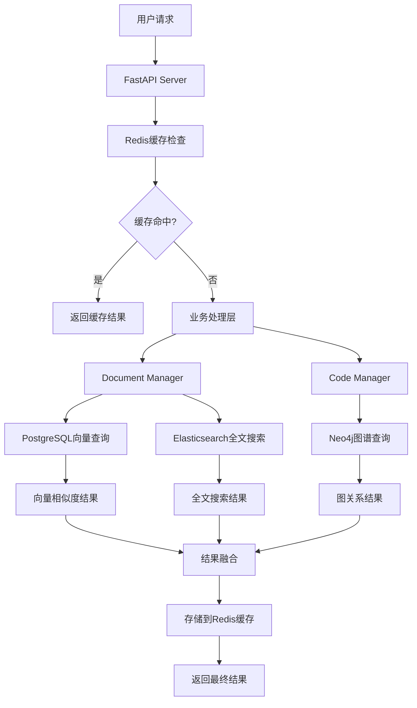

# AI Agent 知识图谱管理系统

一个基于知识图谱的智能文档和代码管理系统，支持文档上传、代码解析、语义搜索和可视化图谱展示。

## 🚀 主要功能

- **文档管理**：支持上传和解析各种文档格式
- **代码解析**：智能解析Go语言代码结构，生成代码文档
- **语义搜索**：基于向量化的语义搜索功能
- **知识图谱**：构建和管理知识图谱，支持实体关系可视化
- **缓存管理**：支持数据缓存和增量更新
- **Web界面**：现代化的React前端界面

## 📋 系统要求

### 基础环境
- Python 3.8+
- Node.js 14+ (用于前端开发)
- 8GB+ 内存 (用于模型加载和数据库)
- 20GB+ 存储空间 (用于模型、数据库和数据)

### 数据库服务 (必需)
- **PostgreSQL** 13+ with pgvector 扩展 (向量存储)
- **Neo4j** 5.0+ Community Edition (知识图谱)
- **Redis** 6.0+ (缓存和会话存储)

### 可选增强
- **Docker** & **Docker Compose** (推荐部署方式)
- **Elasticsearch** 8.0+ (全文搜索增强)

## 🔧 核心组件

### 后端技术栈

#### Web服务框架
- **FastAPI** `>=0.104.0` - 现代高性能Web框架
  - 自动API文档生成 (`/docs`)
  - 类型提示和验证
  - 异步支持
- **Uvicorn** `>=0.24.0` - ASGI服务器
- **Pydantic** `>=2.0.0` - 数据验证和序列化

#### AI/机器学习组件
- **PyTorch** `>=2.0.0` - 深度学习框架
  - 支持CPU和GPU推理
  - 模型加载和管理
- **Transformers** `>=4.35.0` - Hugging Face模型库
  - BGE系列中文向量模型
  - 自动模型下载和缓存
- **Sentence-Transformers** `>=2.2.2` - 句子向量化
  - 语义相似度计算
  - 向量嵌入生成
- **Tokenizers** `>=0.15.0` - 高效文本分词

#### 文档和代码处理
- **LangChain** `>=0.0.350` - 文档处理链
  - 文档加载和分割
  - 多格式支持
- **LangChain-Community** `>=0.0.20` - 社区扩展
- **Python-docx** `>=1.1.0` - Word文档处理
- **PDFPlumber** `>=0.9.0` - PDF文档解析
- **Markdown** `>=3.5.0` - Markdown文档处理
- **Python-multipart** `>=0.0.6` - 文件上传支持

#### 中文处理和图谱
- **Jieba** `>=0.42.1` - 中文分词
  - 智能分词和关键词提取
  - 自定义词典支持
- **NetworkX** `>=3.2.0` - 复杂网络分析
  - 图数据结构
  - 图算法和可视化
- **Scikit-learn** `>=1.3.0` - 机器学习工具
  - TF-IDF向量化
  - 相似度计算

#### 数据库连接组件
- **asyncpg** `>=0.28.0` - 异步PostgreSQL驱动
  - 高性能数据库连接
  - 连接池管理
  - 批量操作支持
- **pgvector** `>=0.2.0` - PostgreSQL向量扩展Python接口
- **neo4j** `>=5.0.0` - Neo4j官方Python驱动
  - 图数据库操作
  - Cypher查询支持
  - 事务管理
- **redis** `>=4.5.0` - Redis Python客户端
  - 缓存操作
  - 发布/订阅
  - 分布式锁
- **elasticsearch** `>=8.0.0` - Elasticsearch客户端 (可选)
  - 全文搜索
  - 聚合查询
  - 索引管理

#### 数据库ORM和工具
- **SQLAlchemy** `>=2.0.0` - Python SQL工具包
  - ORM映射
  - 查询构建器
  - 数据库迁移
- **Alembic** `>=1.12.0` - 数据库版本控制
- **Pydantic** `>=2.0.0` - 数据验证和序列化
#### 系统工具
- **Loguru** `>=0.7.0` - 现代日志系统
- **NumPy** `>=1.24.0` - 数值计算
- **Huggingface-hub** `>=0.19.0` - 模型下载管理
- **TQDM** `>=4.66.0` - 进度条显示
- **Python-dotenv** `>=1.0.0` - 环境变量管理

#### 容器化和部署
- **Docker** - 容器化部署
- **Docker Compose** - 多服务编排
- **Gunicorn** `>=21.0.0` - WSGI服务器 (生产环境)
- **Supervisor** - 进程管理

### 前端技术栈

#### 核心框架
- **React** `^18.2.0` - 用户界面框架
  - 函数式组件和Hooks
  - 虚拟DOM和状态管理
- **React-DOM** `^18.2.0` - DOM渲染
- **TypeScript** - 类型安全的JavaScript
  - 强类型检查
  - 更好的开发体验

#### UI组件库
- **Ant Design** `^5.12.0` - 企业级UI组件
  - 丰富的组件库
  - 中文友好的设计规范
- **@ant-design/icons** `^5.2.0` - 图标库
- **Styled-components** `^6.1.0` - CSS-in-JS样式方案

#### 功能组件
- **Axios** `^1.6.0` - HTTP客户端
  - API请求和响应处理
  - 请求拦截和错误处理
- **React-Router-DOM** `^6.20.0` - 路由管理
- **React-Markdown** `^9.0.0` - Markdown渲染
- **React-Syntax-Highlighter** `^15.5.0` - 代码高亮

#### 图谱可视化
- **D3-Force** `^3.0.0` - 力导向图算法
- **React-Force-Graph-2D** `^1.29.0` - 2D图谱组件
  - 交互式知识图谱展示
  - 节点和边的可视化

#### 开发工具
- **Vite** - 现代前端构建工具
  - 快速的开发服务器
  - 高效的生产构建
- **ESLint** - 代码质量检查
- **Prettier** - 代码格式化
- **DayJS** `^1.11.0` - 轻量级日期处理

### AI模型配置

#### 支持的嵌入模型

1. **BGE-base-zh-v1.5** (推荐)
   - 模型大小: ~390MB
   - 向量维度: 768
   - 适用场景: 中文语义理解
   - 性能: 高质量，中等资源消耗

2. **BGE-large-zh-v1.5** (高性能)
   - 模型大小: ~1.3GB
   - 向量维度: 1024
   - 适用场景: 高精度语义搜索
   - 性能: 最佳效果，高资源消耗

3. **TF-IDF向量化** (轻量级备选)
   - 模型大小: 很小
   - 适用场景: 资源受限环境
   - 性能: 基础效果，最低资源消耗

#### 模型管理功能
- 自动下载和缓存
- 多模型热切换
- 离线运行支持
- 模型验证工具

### 存储组件

#### 向量数据库 - PostgreSQL + pgvector
- **PostgreSQL** `>=13.0` - 企业级关系数据库
  - ACID事务保证
  - 高并发支持
  - 完善的权限管理
- **pgvector** `>=0.5.0` - PostgreSQL向量扩展
  - 原生向量存储和索引
  - 余弦相似度、L2距离等
  - 支持HNSW和IVFFlat索引
- **asyncpg** `>=0.28.0` - 异步PostgreSQL驱动
  - 高性能连接池
  - 批量操作支持

#### 知识图谱数据库 - Neo4j
- **Neo4j** `>=5.0` - 专业图数据库
  - 原生图存储引擎
  - Cypher查询语言
  - 图算法库(GDS)
- **neo4j-driver** `>=5.0.0` - Python驱动
  - 事务支持
  - 连接池管理
  - 异步操作
- **图算法支持**:
  - 路径查找 (Shortest Path, All Paths)
  - 社区发现 (Louvain, Label Propagation)
  - 中心性分析 (PageRank, Betweenness)
  - 相似性计算 (Node Similarity, K-NN)

#### 缓存系统 - Redis
- **Redis** `>=6.0` - 内存数据结构存储
  - 会话管理
  - 查询结果缓存
  - 实时数据交换
- **redis-py** `>=4.5.0` - Python Redis客户端
  - 连接池
  - 发布/订阅
  - 集群支持

#### 全文搜索 - Elasticsearch (可选)
- **Elasticsearch** `>=8.0` - 分布式搜索引擎
  - 中文分词和搜索
  - 复杂查询DSL
  - 聚合分析
- **elasticsearch-py** `>=8.0.0` - Python客户端

#### 数据库特性对比

| 功能 | PostgreSQL+pgvector | Neo4j | Redis | Elasticsearch |
|------|-------------------|-------|-------|---------------|
| **向量搜索** | ⭐⭐⭐ 原生支持 | ⭐ 插件支持 | ⭐⭐ 扩展支持 | ⭐⭐ 密集向量 |
| **图查询** | ⭐⭐ 递归CTE | ⭐⭐⭐ 原生支持 | ⭐ 基础支持 | ⭐ 父子关系 |
| **全文搜索** | ⭐⭐ 内置FTS | ⭐⭐ 索引支持 | ⭐⭐ 模块支持 | ⭐⭐⭐ 专业引擎 |
| **事务支持** | ⭐⭐⭐ ACID | ⭐⭐⭐ ACID | ⭐⭐ 原子操作 | ⭐ 文档级别 |
| **性能** | ⭐⭐⭐ 高性能 | ⭐⭐⭐ 图优化 | ⭐⭐⭐ 极速 | ⭐⭐⭐ 搜索优化 |
| **扩展性** | ⭐⭐⭐ 水平扩展 | ⭐⭐ 集群 | ⭐⭐⭐ 集群 | ⭐⭐⭐ 分片 |

### 部署支持

#### 容器化 (计划中)
- Docker镜像
- Docker Compose编排
- 环境隔离

#### 云原生 (计划中)
- Kubernetes支持
- 弹性伸缩
- 服务发现

## 🛠 安装指南

### 方式一：Docker Compose 一键部署 (推荐)

#### 1. 克隆项目
```bash
git clone [项目地址]
cd knowledge-map
```

#### 2. 启动所有服务
```bash
# 启动数据库和应用服务
docker-compose up -d

# 查看服务状态
docker-compose ps
```

#### 3. 访问服务
- 前端界面: http://localhost:3000
- 后端API: http://localhost:8000
- Neo4j浏览器: http://localhost:7474
- API文档: http://localhost:8000/docs

### 方式二：手动安装

#### 1. 安装数据库服务

##### PostgreSQL + pgvector
```bash
# Ubuntu/Debian
sudo apt update
sudo apt install postgresql-15 postgresql-contrib

# 安装pgvector扩展
sudo apt install postgresql-15-pgvector

# 启动PostgreSQL
sudo systemctl start postgresql
sudo systemctl enable postgresql

# 创建数据库和用户
sudo -u postgres psql
CREATE DATABASE knowledge_graph;
CREATE USER kg_user WITH PASSWORD 'your_password';
GRANT ALL PRIVILEGES ON DATABASE knowledge_graph TO kg_user;

# 启用pgvector扩展
\c knowledge_graph
CREATE EXTENSION vector;
\q
```

##### Neo4j Community Edition
```bash
# 下载并安装Neo4j
wget -O - https://debian.neo4j.com/neotechnology.gpg.key | sudo apt-key add -
echo 'deb https://debian.neo4j.com stable latest' | sudo tee /etc/apt/sources.list.d/neo4j.list
sudo apt update
sudo apt install neo4j

# 配置Neo4j
sudo systemctl start neo4j
sudo systemctl enable neo4j

# 设置初始密码
sudo neo4j-admin set-initial-password your_neo4j_password
```

##### Redis
```bash
# Ubuntu/Debian
sudo apt install redis-server

# 启动Redis
sudo systemctl start redis-server
sudo systemctl enable redis-server

# 验证安装
redis-cli ping
```

#### 2. 配置环境变量
```bash
# 创建.env文件
cp .env.example .env

# 编辑配置
nano .env
```

```env
# 数据库配置
POSTGRES_HOST=localhost
POSTGRES_PORT=5432
POSTGRES_DB=knowledge_graph
POSTGRES_USER=kg_user
POSTGRES_PASSWORD=your_password

NEO4J_URI=bolt://localhost:7687
NEO4J_USER=neo4j
NEO4J_PASSWORD=your_neo4j_password

REDIS_URL=redis://localhost:6379/0

# 可选 - Elasticsearch
ELASTICSEARCH_URL=http://localhost:9200
```

#### 3. 安装Python依赖
#### 3. 安装Python依赖
```bash
pip install -r requirements.txt
```

如果下载失败，可以使用国内镜像：
```bash
pip install -r requirements.txt -i https://pypi.tuna.tsinghua.edu.cn/simple/
```

#### 4. 初始化数据库
```bash
# 创建数据库表结构
python init_database.py

# 验证数据库连接
python verify_database.py
```

#### 5. 下载嵌入模型

#### 自动下载（推荐）
系统会自动下载BGE中文模型到 `data/models/` 目录。

#### 手动下载（网络不稳定时）
如果自动下载失败，请参考 `MODEL_DOWNLOAD.md` 进行手动下载：

1. 访问HF-Mirror国内镜像：https://hf-mirror.com/BAAI/bge-base-zh-v1.5
2. 下载以下文件到 `data/models/BAAI/bge-base-zh-v1.5/`：
   - config.json
   - pytorch_model.bin (约390MB)
   - tokenizer.json
   - tokenizer_config.json
   - vocab.txt
   - special_tokens_map.json
   - sentence_bert_config.json
   - modules.json

#### 验证模型
```bash
python verify_model.py
```

#### 6. 安装前端依赖（可选）
```bash
cd frontend
npm install
```

## 🚀 启动系统

### 方法1：使用启动脚本
```bash
# Windows
start.bat

# Linux/Mac
./start.sh
```

### 方法2：手动启动
```bash
# 启动后端API
python main.py

# 启动前端 (新终端)
cd frontend
npm run dev
```

系统启动后：
- 后端API: http://localhost:8000
- 前端界面: http://localhost:3000
- API文档: http://localhost:8000/docs

## � 命令行操作

### 主程序命令 (main.py)

#### 基本用法
```bash
# 显示帮助信息
python main.py --help

# 启动Web服务器
python main.py

# 显示系统状态
python main.py --status

# 列出可用组件
python main.py --components
```

#### 文件处理
```bash
# 处理单个文件
python main.py --file document.pdf
python main.py -f code.go

# 处理整个目录（递归）
python main.py --directory /path/to/docs
python main.py -d ./code --recursive

# 处理目录但不保存图谱文件
python main.py -d ./docs --no-save
```

#### 搜索功能
```bash
# 搜索知识库
python main.py --search "关键词"
python main.py -s "代码片段"
```

#### 自定义配置
```bash
# 使用自定义配置文件
python main.py --config custom_config.py
```

### 数据管理命令 (manage_data.py)

#### 查看数据状态
```bash
# 显示统计信息
python manage_data.py --stats

# 列出所有文档
python manage_data.py --list

# 列出数据来源
python manage_data.py --sources
```

#### 数据清理
```bash
# 删除指定来源的文档
python manage_data.py --delete-source "filename.pdf"

# 重置所有数据（谨慎使用）
python manage_data.py --reset

# 清理缓存文件
python manage_data.py --clean-cache
```

#### 组合使用示例
```bash
# 批量处理并查看结果
python main.py -d ./documents
python manage_data.py --stats

# 清理特定数据后重新处理
python manage_data.py --delete-source "old_doc.pdf"
python main.py -f new_doc.pdf
```

## �📖 使用方法

### Web界面操作

#### 文档上传和搜索
1. 访问前端界面
2. 在"文档上传"页面上传文档
3. 在"文档搜索"页面进行语义搜索

### 代码解析
1. 在"代码上传"页面上传Go代码文件
2. 系统自动解析代码结构
3. 在"代码搜索"页面搜索相关代码

### API使用示例

#### 上传文档
```bash
curl -X POST "http://localhost:8000/documents/upload" \
  -F "file=@document.pdf" \
  -F "metadata={\"source\": \"user_upload\"}"
```

#### 搜索文档
```bash
curl -X POST "http://localhost:8000/documents/search" \
  -H "Content-Type: application/json" \
  -d '{"query": "搜索关键词", "top_k": 5}'
```

#### 上传代码
```bash
curl -X POST "http://localhost:8000/code/upload" \
  -F "file=@main.go" \
  -F "language=go"
```

## 🏗 项目架构

### 整体架构设计

本项目采用**微服务架构**和**分层设计**，使用企业级开源数据库：

```
┌─────────────────────────────────────────────────────────────┐
│                    表示层 (Presentation)                    │
├─────────────────────┬───────────────────────────────────────┤
│   Web API Server   │        React Frontend               │
│   (FastAPI)         │        (TypeScript + Vite)          │
└─────────────────────┴───────────────────────────────────────┘
┌─────────────────────────────────────────────────────────────┐
│                    业务层 (Business)                       │
├─────────────────────┬───────────────────────────────────────┤
│   Document Manager  │        Code Manager                 │
│   (文档处理)         │        (代码解析)                    │
└─────────────────────┴───────────────────────────────────────┘
┌─────────────────────────────────────────────────────────────┐
│                    服务层 (Service)                        │
├─────────────────────┬───────────────────────────────────────┤
│   Factory Pattern   │        Interface Layer              │
│   (组件工厂)         │        (数据库适配器)                │
└─────────────────────┴───────────────────────────────────────┘
┌─────────────────────────────────────────────────────────────┐
│                   数据层 (Database)                        │
├─────────────┬─────────────┬─────────────┬─────────────────┤
│ PostgreSQL  │    Neo4j    │   Redis     │  Elasticsearch  │
│ (向量存储)   │  (知识图谱)  │  (缓存)     │   (全文搜索)     │
└─────────────┴─────────────┴─────────────┴─────────────────┘
```

### 设计模式

- **工厂模式**: `core/factory.py` 统一管理组件创建
- **接口隔离**: `interfaces/` 定义抽象接口，支持多种实现
- **策略模式**: 支持多种嵌入模型和解析器的动态切换
- **单例模式**: 配置管理和资源共享

### 目录结构详解

```
knowledge-map/
├── 📁 api_server.py               # 🌐 FastAPI 服务器主文件
├── 📁 main.py                     # 🚀 主程序入口，支持命令行操作
├── 📁 config.py                   # ⚙️ 全局配置管理
├── 📁 manage_data.py             # 🗃️ 数据管理工具
├── 📁 verify_model.py            # ✅ 模型验证工具
│
├── 📁 core/                      # 🏭 核心工厂层
│   ├── factory.py                # 组件工厂，管理所有组件创建
│   ├── code_manager.py           # 代码处理业务逻辑
│   └── document_manager.py       # 文档处理业务逻辑
│
├── 📁 interfaces/                # 🔗 抽象接口层
│   ├── __init__.py               # 接口导出
│   ├── code_parser.py            # 代码解析接口
│   ├── document_parser.py        # 文档解析接口
│   ├── embedding_provider.py     # 嵌入模型接口
│   ├── knowledge_graph.py        # 知识图谱接口
│   └── vector_store.py           # 向量存储接口
│
├── 📁 implementations/           # 🔧 具体实现层
│   ├── 📁 embeddings/            # 嵌入模型实现
│   │   ├── local_provider.py     # 本地BGE模型
│   │   ├── advanced_provider.py  # 高级模型支持
│   │   └── local_provider_tfidf.py # TF-IDF备用方案
│   ├── 📁 graphs/                # 图谱存储实现
│   │   └── local_graph.py        # 本地NetworkX图谱
│   ├── 📁 parsers/               # 解析器实现
│   │   ├── code_parser_factory.py # 代码解析工厂
│   │   ├── go_code_parser.py     # Go语言解析器
│   │   ├── go_document_generator.py # Go文档生成器
│   │   ├── go_structure_extractor.py # Go结构提取器
│   │   └── default_parser.py     # 默认文档解析器
│   └── 📁 stores/                # 存储实现
│       └── local_store.py        # 本地向量存储
│
├── 📁 data/                      # 📊 数据存储目录
│   ├── 📁 models/                # AI模型文件
│   │   └── 📁 bge-base-zh-v1.5/  # BGE中文向量模型
│   ├── 📁 uploads/               # 用户上传文件
│   ├── 📁 documents/             # 处理后的文档
│   ├── 📁 code/                  # 处理后的代码
│   ├── 📁 graphs/                # 知识图谱数据
│   └── 📁 vector_store/          # 向量索引文件
│
└── 📁 frontend/                  # 🎨 前端应用
    ├── 📁 src/                   # React源码
    │   ├── 📁 components/        # UI组件
    │   ├── 📁 services/          # API服务
    │   └── 📁 utils/             # 工具函数
    ├── 📁 public/                # 静态资源
    ├── package.json              # 前端依赖
    └── vite.config.js            # 构建配置
```

### 核心组件交互



### 可扩展性设计

1. **新增解析器**: 继承 `CodeParserInterface` 或 `DocumentParserInterface`
2. **新增存储**: 实现 `VectorStoreInterface` 支持不同数据库
3. **新增模型**: 实现 `EmbeddingProviderInterface` 支持其他AI模型
4. **新增图谱**: 实现 `KnowledgeGraphInterface` 支持图数据库

## 🔧 配置选项

### 数据库配置 (`.env`)
```env
# PostgreSQL向量数据库
POSTGRES_HOST=localhost
POSTGRES_PORT=5432
POSTGRES_DB=knowledge_graph
POSTGRES_USER=kg_user
POSTGRES_PASSWORD=your_password
POSTGRES_MAX_CONNECTIONS=20

# Neo4j图数据库
NEO4J_URI=bolt://localhost:7687
NEO4J_USER=neo4j
NEO4J_PASSWORD=your_neo4j_password
NEO4J_MAX_CONNECTION_POOL_SIZE=50

# Redis缓存
REDIS_URL=redis://localhost:6379/0
REDIS_MAX_CONNECTIONS=10
REDIS_CACHE_TTL=3600

# Elasticsearch (可选)
ELASTICSEARCH_URL=http://localhost:9200
ELASTICSEARCH_INDEX_PREFIX=kg_
```

### 模型配置 (`config.py`)
```python
# 本地模型路径配置
LOCAL_MODELS = {
    "bge-base-zh-v1.5": "data/models/BAAI/bge-base-zh-v1.5",
    "bge-large-zh-v1.5": "data/models/BAAI/bge-large-zh-v1.5"
}

# 默认使用的模型
DEFAULT_EMBEDDING_MODEL = "bge-base-zh-v1.5"

# 向量索引配置
VECTOR_INDEX_CONFIG = {
    "method": "hnsw",  # 或 "ivfflat"
    "m": 16,           # HNSW参数
    "ef_construction": 64
}
```

### API配置
- 端口: 8000 (可在main.py中修改)
- CORS: 已启用跨域访问
- 上传限制: 50MB (可调整)
- 数据库连接池: 自动管理

### 性能调优配置
```env
# 向量搜索优化
VECTOR_SEARCH_LIMIT=1000
VECTOR_CACHE_SIZE=10000

# 图查询优化
GRAPH_QUERY_TIMEOUT=30
GRAPH_MAX_DEPTH=6

# 缓存策略
CACHE_STRATEGY=lru
CACHE_MAX_SIZE=1000MB
```

## 🐛 常见问题

### 1. 模型下载失败
**问题**: 网络连接问题导致模型下载失败
**解决方案**: 
- 使用手动下载方式
- 配置国内镜像源
- 检查防火墙设置

### 2. 内存不足
**问题**: 加载模型时内存不足
**解决方案**:
- 确保至少4GB可用内存
- 关闭其他大型应用
- 考虑使用更小的模型

### 3. 端口占用
**问题**: 8000端口被占用
**解决方案**:
```bash
# 查找占用端口的进程
netstat -ano | findstr :8000

# 修改config.py中的端口配置
```

### 4. 前端无法访问后端
**问题**: CORS或网络配置问题
**解决方案**:
- 检查后端是否正常启动
- 确认防火墙设置
- 查看浏览器控制台错误信息

## 📊 性能优化

### 模型选择
- **BGE-base-zh-v1.5**: 平衡性能和效果 (推荐)
- **BGE-large-zh-v1.5**: 更好效果，需要更多资源
- **TF-IDF**: 轻量级备用方案

### 缓存策略
- 向量缓存: 避免重复计算
- 图谱缓存: 提高查询速度
- 增量更新: 只处理新增数据

## 🔄 更新和维护

### 更新模型
```bash
# 删除旧模型
rm -rf data/models/BAAI/bge-base-zh-v1.5

# 重新启动系统自动下载
python main.py
```

### 清理缓存
```bash
python manage_data.py --clear-cache
```

### 数据备份
```bash
# 备份图谱数据
cp -r data/graphs/ backup/graphs/

# 备份向量数据
cp -r data/vector_store/ backup/vector_store/
```

## 🤝 贡献指南

1. Fork 项目
2. 创建功能分支
3. 提交更改
4. 发起 Pull Request

## 📄 许可证

本项目采用 MIT 许可证。

## 📞 技术支持

如有问题，请：
1. 查看本文档的常见问题部分
2. 检查 `verify_model.py` 的输出
3. 查看系统日志和错误信息
4. 提交 Issue 描述具体问题

---

**注意**: 首次启动时会自动下载模型，请耐心等待。如果网络不稳定，建议使用手动下载方式。